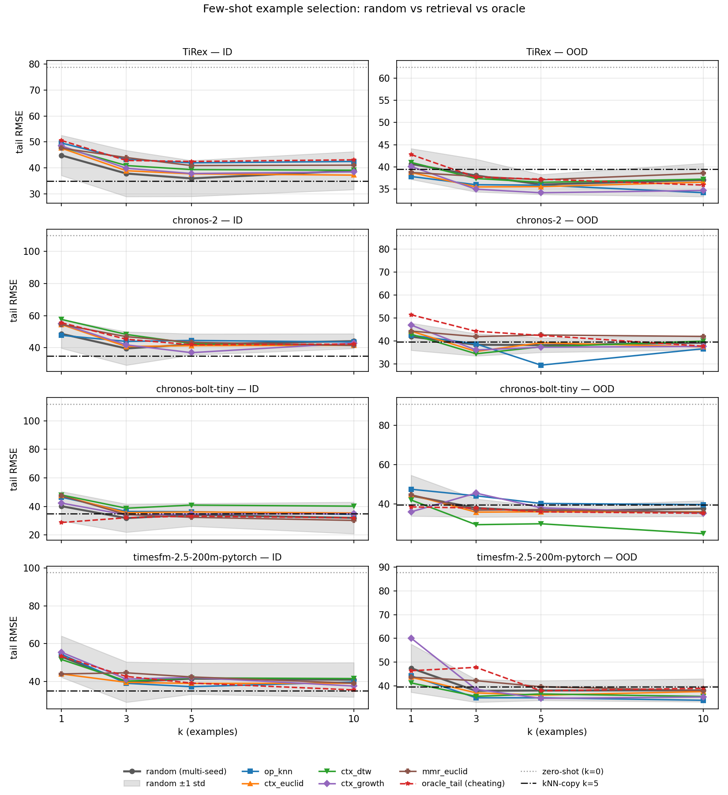
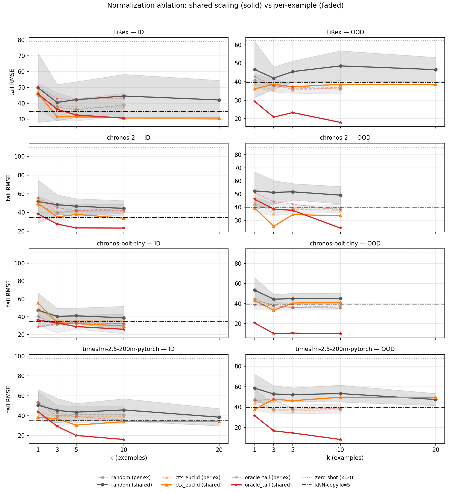
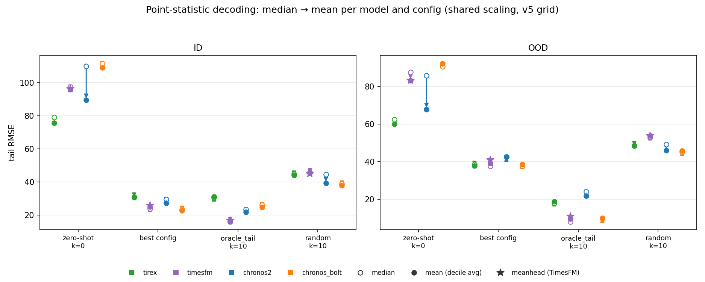
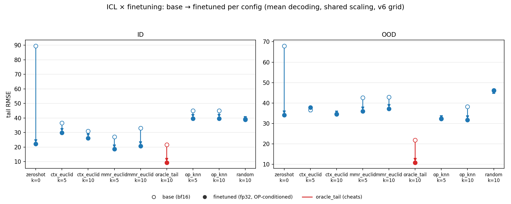
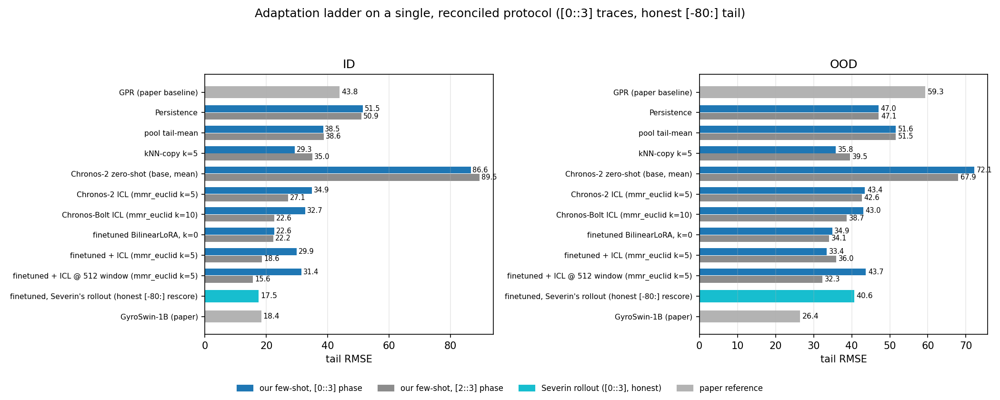

# ⚛️ Flux Time Series Prediction in Tokamak Reactors


Can pre-trained time-series foundation models predict turbulent heat flux in fusion reactors? This project benchmarks zero-shot, few-shot in-context learning, and finetuning performance of state-of-the-art time-series foundation models (TiRex, Chronos, TimesFM) on heat flux traces from gyrokinetic plasma turbulence simulations.

The work is split between two contributors:

- **Zero-shot benchmarking & finetuning** — Severin Bergsmann ([@sbergsmann](https://github.com/sbergsmann))
- **Few-shot in-context learning** — Lukas Kurz ([@lukaskurz](https://github.com/lukaskurz))

## 🔬 Background: The GyroSwin Paper

This project builds on **GyroSwin: 5D Surrogates for Gyrokinetic Plasma Turbulence Simulations** ([Paischer et al., 2025](https://arxiv.org/abs/2510.07314), see [References](#references)). GyroSwin is a neural surrogate for the nonlinear gyrokinetic equations governing plasma turbulence: it evolves the full 5D distribution function $f(k_x, k_y, s, v_\parallel, \mu)$ over time and predicts 3D electrostatic potential fields and the scalar heat flux $\bar{Q}$, replacing prohibitively expensive numerical simulations (three orders of magnitude speedup over the GKW solver).

**The data**: 255 nonlinear simulations generated with the GKW gyrokinetic code (adiabatic electron approximation), varying four operating parameters: safety factor $q$, magnetic shear $\hat{s}$, ion temperature gradient $R/L_T$, and density gradient $R/L_n$.

**Our angle**: instead of modelling the 5D state, we treat the heat flux $\bar{Q}(t)$ as a plain 1D time series and ask how far modern time-series foundation models get — with no physics, no operating parameters, and (for zero-/few-shot) no training at all.

## 📐 Evaluation Protocol

We follow the GyroSwin paper's evaluation exactly, so our numbers are directly comparable to theirs:

- **Test sets**: 6 in-distribution (ID) simulations (inside the convex hull of the training parameters, but unseen) and 5 out-of-distribution (OOD) simulations (outside the convex hull)
- **Metric**: RMSE of the **time-averaged heat flux** $\bar{Q}$ over the final 80 timesteps, after an autoregressive rollout
- **Setup**: traces are subsampled every 3rd step (800 → 266 timesteps); models see the first 80 timesteps (linear phase) as context and forecast autoregressively in steps of 64
- Per-trace z-score normalization, seed 42

## 📊 Results

### 1. Baselines from the GyroSwin Paper

What we are competing against — heat flux RMSE as reported in the paper (Table 2, same 6 ID + 5 OOD simulations, same metric):

| Method                  | Type                          | ID $\bar{Q}$ (↓) | OOD $\bar{Q}$ (↓) |
| ----------------------- | ----------------------------- | ---------------- | ----------------- |
| QL / QuaLiKiz           | Reduced-order quasilinear     | 89.53 ± 11.76    | 95.22 ± 21.57     |
| GPR                     | 0D surrogate (op. params)     | 43.82 ± 10.84    | 59.28 ± 17.55     |
| MLP                     | 0D surrogate (op. params)     | 50.50 ± 10.79    | 61.98 ± 18.41     |
| FNO                     | Neural PDE surrogate          | 119.88 ± 13.15   | 124.96 ± 23.27    |
| PointNet                | Neural PDE surrogate          | 119.93 ± 13.15   | 125.05 ± 23.29    |
| Transolver              | Neural PDE surrogate          | 119.93 ± 13.15   | 125.05 ± 23.28    |
| ViT                     | Neural PDE surrogate          | 119.63 ± 13.13   | 125.13 ± 23.29    |
| GyroSwin (48 sims)      | 5D surrogate                  | 67.68 ± 10.28    | 70.48 ± 17.21     |
| **GyroSwin-1B (Large)** | 5D surrogate (241 sims)       | **18.35 ± 1.56** | **26.43 ± 9.49**  |

The neural PDE surrogates (FNO, PointNet, Transolver, ViT) all collapse to nearly identical, poor heat flux predictions — capturing $\bar{Q}$ from the 5D state is hard. The strongest baseline is the full GyroSwin-1B model trained on 241 simulations.

### 2. Zero-Shot Results

*by Severin Bergsmann*

Pre-trained time-series foundation models applied out of the box — no training, no fusion data, no operating parameters:

| Base Model               | ID $\bar{Q}$ (↓)  | OOD $\bar{Q}$ (↓) | Inference Time [s]  |
| ------------------------ | ----------------- | ----------------- | ------------------- |
| google/timesfm-2.0-500m  | 156.17 ± 67.31    | 98.61 ± 23.55     | 5.65 ± 5.82e-2      |
| amazon/chronos-bolt-tiny | 110.15 ± 14.08    | 92.89 ± 21.16     | **0.030 ± 1.08e-3** |
| amazon/chronos2          | 107.09 ± 15.74    | 87.47 ± 22.08     | 0.073 ± 1.72e-3     |
| google/timesfm-2.5-200m  | 104.23 ± 14.87    | 87.20 ± 25.05     | 0.231 ± 7.23e-3     |
| NX-AI/TiRex              | **79.49 ± 14.38** | **64.03 ± 19.53** | 1.95 ± 1.63e-2      |

**Takeaway**: with zero exposure to fusion data, TiRex (79.49 ID / 64.03 OOD) already beats the paper's quasilinear QuaLiKiz baseline (89.53 / 95.22) and all neural PDE surrogates, and matches the 48-simulation GyroSwin on ID while clearly beating it on OOD. Forecast plots per model are in [docs/results/zeroshot/](docs/results/zeroshot/).

### 3. Few-Shot In-Context Learning Results

*by Lukas Kurz*

The same pre-trained models, but provided with $k$ example traces (80-timestep context followed by the full remaining trace as target, randomly sampled from the 245-trace training pool, test traces excluded) at inference time — still **no finetuning, no gradient updates**.

> **Note (2026-06-11)**: these tables come from a re-run after fixing an example-pool bug: the original pool excluded pool *positions* instead of trace ids, so near-duplicate twins of all six ID test traces remained selectable as examples. The earlier published numbers (e.g. TiRex k=5 at 42.33 ID, with 64-step example targets) were flattered by this — that configuration is 66.32 ID with the fixed pool. Zero-shot (k=0) numbers are unaffected. Tables below: fixed pool, full-length example targets (`results/few_shot_v2_t266/`); the re-run of the old 64-step-target protocol is in `results/few_shot_v2_t80/`.

**Best configuration per model:**

| Model                           | k   | ID RMSE (↓)      | OOD RMSE (↓)      | Improvement vs Zero-Shot |
| ------------------------------- | --- | ---------------- | ----------------- | ------------------------ |
| **amazon/chronos-bolt-tiny**    | 10  | **30.65 ± 8.64** | **34.62 ± 13.36** | **72.6% ID / 61.8% OOD** |
| NX-AI/TiRex                     | 10  | 37.78 ± 8.64     | 36.49 ± 15.59     | 52.1% ID / 41.6% OOD     |
| google/timesfm-2.5-200m-pytorch | 10  | 39.34 ± 8.37     | 35.68 ± 15.92     | 59.7% ID / 59.3% OOD     |
| amazon/chronos-2                | 5   | 40.36 ± 8.56     | 36.35 ± 16.65     | 63.3% ID / 57.7% OOD     |

**Model-free baselines** (same metric, same fixed pool — `benchmarking/few_shot/baselines.py`):

| Baseline                          | ID RMSE (↓)   | OOD RMSE (↓)  |
| --------------------------------- | ------------- | ------------- |
| Persistence (last context value)  | 50.91 ± 10.98 | 47.07 ± 17.41 |
| Training-pool tail-mean           | 38.65 ± 6.17  | 51.54 ± 14.72 |
| kNN-copy (k=1, context distance)  | 44.24 ± 12.33 | 36.94 ± 10.91 |
| kNN-copy (k=5)                    | 34.98 ± 11.11 | 39.54 ± 8.10  |

> **Follow-up — match on *level*, not *shape*** ([docs/results/fewshot/level_matching.md](docs/results/fewshot/level_matching.md)): kNN-copy's distance z-scores the contexts, matching example *shape* and discarding the absolute level the metric scores. Matching on the context *level* alone (`|mean(ctx) − mean(query)|`) is best on both splits and far better OOD (kNN-copy 39.54 → **28.46** OOD; in the Bolt ICL pipeline the new `ctx_level` retrieval strategy reaches **21.91** OOD at k=5 — the project's lowest OOD). And no single constant can beat ~32 ID / ~47 OOD (the *spread* of the test levels): `pool_tail_mean`'s 38.65 is the best *blind* constant but biased low (it predicts 94 where the ID traces sit at ~115), so only per-query adaptation beats the floor. Both confirm the Phase-7 mechanism finding that the early-context mean is the strongest level predictor (ρ ≈ +0.89).

<details>
<summary><b>Full k-shot learning curves</b> (k = 0, 1, 3, 5, 10)</summary>

**Chronos-2:**
| k   | ID RMSE | OOD RMSE | ID Δ%  | OOD Δ% |
| --- | ------- | -------- | ------ | ------ |
| 0   | 109.91  | 85.86    | —      | —      |
| 1   | 49.04   | 40.03    | -55.4% | -53.4% |
| 3   | 43.78   | 38.68    | -60.2% | -54.9% |
| 5   | 40.36   | 36.35    | -63.3% | -57.7% |
| 10  | 48.82   | 41.51    | -55.6% | -51.7% |

**TimesFM-2.5:**
| k   | ID RMSE | OOD RMSE | ID Δ%  | OOD Δ% |
| --- | ------- | -------- | ------ | ------ |
| 0   | 97.54   | 87.70    | —      | —      |
| 1   | 45.16   | 38.89    | -53.7% | -55.7% |
| 3   | 42.50   | 37.82    | -56.4% | -56.9% |
| 5   | 39.58   | 36.67    | -59.4% | -58.2% |
| 10  | 39.34   | 35.68    | -59.7% | -59.3% |

**TiRex:**
| k   | ID RMSE | OOD RMSE | ID Δ%  | OOD Δ% |
| --- | ------- | -------- | ------ | ------ |
| 0   | 78.92   | 62.49    | —      | —      |
| 1   | 43.61   | 38.60    | -44.7% | -38.2% |
| 3   | 39.66   | 36.46    | -49.7% | -41.6% |
| 5   | 38.54   | 36.50    | -51.2% | -41.6% |
| 10  | 37.78   | 36.49    | -52.1% | -41.6% |

**Chronos-Bolt-Tiny:**
| k   | ID RMSE | OOD RMSE | ID Δ%  | OOD Δ% |
| --- | ------- | -------- | ------ | ------ |
| 0   | 111.65  | 90.69    | —      | —      |
| 1   | 50.86   | 44.77    | -54.4% | -50.6% |
| 3   | 40.68   | 36.95    | -63.6% | -59.3% |
| 5   | 34.50   | 35.62    | -69.1% | -60.7% |
| 10  | 30.65   | 34.62    | -72.6% | -61.8% |

</details>

**Key findings:**

- 🎯 **Chronos-Bolt-Tiny at k=10 achieves the best training-free result**: 30.65 ID / 34.62 OOD RMSE — better than every paper baseline except the full GyroSwin-1B, at zero training cost
- 📈 **More examples keep helping up to k=10** for Bolt, TiRex and TimesFM; only Chronos-2 peaks at k=5. (The previously reported k=10 degradation and "Bolt saturates at k=1" were artifacts of the leaky pool and the 64-step example targets.)
- 🆚 **Retrieval alone is a strong baseline**: model-free kNN-copy (k=5) reaches 34.98 ID — much of the few-shot gain is saturation-level calibration, and only Bolt at k=10 clearly beats it ID (the TSFMs do beat the baselines OOD)
- 🔄 **Improvements transfer to OOD**: ~61% ID / ~55% OOD average reduction at k=5
- 💡 In-context examples recover a large share of finetuning's gains (see below) **without any gradient updates**

#### Example selection: random vs retrieval vs oracle

Phase 2 replaces random example selection with informed retrieval (`benchmarking/few_shot/selection.py`): operating-parameter kNN (`op_knn`), context-similarity NN (`ctx_euclid` / `ctx_dtw` / `ctx_growth`), a diversity-aware MMR variant (`mmr_euclid`), and a label-aware *cheating* oracle (`oracle_tail`) as headroom diagnostic — full grid (7 strategies × k ∈ {1,3,5,10} × 4 models, random = 20 seeds) in `results/few_shot_v2_selection/`, table + significance tests in [docs/results/fewshot/selection_table.md](docs/results/fewshot/selection_table.md).



**Finding**: under the current presentation format (flat concatenation, per-example z-scoring), informed retrieval does **not** beat 20-seed random selection in-distribution — every bootstrap CI straddles zero, and even the cheating oracle is no better than random ID for 3 of 4 models (only Chronos-Bolt at k=1 shows clear headroom: 28.76 ID). Since each example is z-scored independently, its absolute saturation *level* — the very signal retrieval matches on — never reaches the model; this hands off directly to Phase 3's shared-scaling ablation. Out-of-distribution, retrieval gives small but consistent gains (bootstrap-significant for TimesFM, e.g. op_knn +3.2 RMSE vs random, and Chronos-2 ctx_euclid +3.2). On Fabian's question — operating-parameter kNN does **not** beat context similarity anywhere (on TiRex ID, ctx_euclid is significantly better than op_knn: Δ = 4.75, bootstrap CI [1.5, 10.2], Wilcoxon p = 0.031), i.e. the 80-step context already encodes the regime information the parameters would provide.

#### Example presentation: *how* examples are shown matters more than *which* are picked

Phase 3 (`benchmarking/few_shot/presentation.py`) tests the presentation fixes Phase 2's diagnosis called for — full grid in `results/few_shot_v3_presentation/`, table + significance tests in [docs/results/fewshot/presentation_table.md](docs/results/fewshot/presentation_table.md).



- **Shared scaling confirms the Phase-2 diagnosis.** Normalizing examples with ONE scaler fit on the query context (instead of per-example z-scoring) lets the examples' absolute saturation level reach the model, and the picture inverts: the cheating oracle drops from ≈ random to its best results everywhere (TimesFM 15.99 ID / 8.10 OOD at k=10; TiRex 30.65 / 18.01) and now beats shared-norm random with bootstrap-significant margins on **all four models, both splits** (e.g. TimesFM Δ = −23.4 ID / −39.7 OOD, p ≤ 0.001) — that headroom simply did not exist under per-example scoring. The flip side: *random* selection under shared scaling gets significantly **worse** ID for 3 of 4 models (wrong levels now transfer too), so shared scaling only makes sense *with* retrieval. Retrieval does cash in part of the headroom: ctx_euclid/mmr_euclid improve over their per-example bases everywhere (TiRex ctx_euclid k=10: 30.77 vs 37.22 ID), and the best legitimate training-free ID cells improve from 30.65 (Bolt k=10, Phase 1) to **23.28** (Bolt, mmr_euclid shared k=10) and **23.85** (TimesFM, mmr_euclid shared k=10) — though retrieval-vs-random-under-shared CIs still straddle zero at n=6 traces.
- **Chronos-2 group ICL is much worse than flat concat** on identical example sets (random k=5: 79.1 vs 42.1 ID; even at k=20 group stays ≈ 68–72 vs concat's 38–42): examples passed as group-attention covariate rows barely act as demonstrations, and Chronos-2's per-row instance norm means group mode cannot restore level either — group ICL and shared scaling fix *different* problems, and only the level one matters here. See [docs/results/fewshot/presentation_group_vs_concat.png](docs/results/fewshot/presentation_group_vs_concat.png).
- **Ordering is a non-factor**: most-similar-last vs -first vs shuffled changes ctx_euclid by ±1–4 RMSE with no consistent direction (shuffled-order seed std ≤ 6).
- **Truncating examples backfires under shared scaling** (TiRex ctx_euclid k=10: 42.9 truncated vs 30.8 full; trunc k=20 also loses to full k=10) — truncation cuts off exactly the saturation tail that shared scaling lets the model copy. The context-budget motivation didn't survive contact with the level mechanism.

#### Operating-parameter conditioning without training

Phase 4 (`benchmarking/few_shot/covariates.py`) closes the adaptation ladder between ICL and Severin's finetuned operating-parameter conditioning: the 4 static parameters (q, ŝ, R/L_T, R/L_n) are passed to Chronos-2 — the only benchmarked model with zero-shot covariate support — as extra covariate channels, with no training. Grid in `results/few_shot_v4_covariates/` (Chronos-2, shared scaling, +cov vs no-cov vs permuted-params control on identical example sets), table + significance tests in [docs/results/fewshot/covariates_table.md](docs/results/fewshot/covariates_table.md).

A structural result shapes the design: Chronos-2 instance-norms every covariate row independently (positive-affine invariant, so raw vs normalized parameter values are provably indistinguishable), which means a **constant** channel has its value erased exactly — verified down to bit-identical forecasts for two different parameter values engineered to share the post-norm rows. Static parameters can only act through *within-row contrast*, so they are encoded as step functions over the ICL stream (each example's params over its segment, the query's over the query segment).

| rung (Chronos-2 throughout) | ID RMSE | OOD RMSE |
| --------------------------------------------- | ------ | ------ |
| zero-shot | 109.91 | 85.86 |
| ICL, best legit (mmr_euclid shared k=5) | 29.40 | 42.56 |
| ICL + OP covariates, best legit (ctx_euclid k=10) | 44.61 | 40.08 |
| oracle_tail ceiling (cheats, k=10) | 23.31 | 23.99 |
| finetuned OPC (BilinearLoRA, cross-run; `[:-80]` metric — see the metric audit below) | 13.83 | 4.86 |

**Finding — training-free conditioning does not work, and the controls show why.** +cov is statistically indistinguishable from the permuted-params control at every comparable cell (e.g. random k=10: 48.48 vs 47.90 ID) — the channels contribute *presence*, not parameter *information*. That presence acts as a level-homogenizing perturbation: it pulls every configuration toward ≈47 ID regardless of selection strategy, which *helps* weak anchors (zero-shot + constant channels: 109.91 → 81.02 ID, despite the channels provably carrying no value information; random OOD improves ~6 RMSE, matched by the permuted control) and *destroys* strong ones (oracle k=10: 23.31 → 47.28 ID, bootstrap CI [8.1, 35.0]). Group-mode covariates are structurally inert as predicted and slightly harmful in practice. The conditioning signal this metric needs — absolute level from absolute parameters — cannot survive the per-row instance norm, which is precisely the gap finetuned conditioning (next section) closes: see the full ladder in [docs/results/fewshot/adaptation_ladder.png](docs/results/fewshot/adaptation_ladder.png).

#### Decoding and ensembling: mean vs median is a per-model knob

The benchmark metric is tail RMSE of a positive, right-skewed flux, so the RMSE-optimal point forecast is the conditional **mean** — yet every cell above decodes the **median** (q0.5 of the 9 forecast quantiles). Phase 5 (`benchmarking/few_shot/run_decoding_grid.py`) adds a `point_stat` knob to the model wrappers and re-runs anchors, the best Phase-3 configs, the oracle ceiling and 20-seed random cells under both decodings: `mean` is the decile average (1/9)·Σ q₀.₁..q₀.₉ (biased *low* on right-skewed data — it truncates the tails beyond q0.1/q0.9), and TimesFM additionally runs its native mean head (`meanhead`) as the unbiased cross-check. Two wiring discoveries: **TiRex has no native mean** (its `forecast()` "mean" return is a relabeled median — `# median as mean` in the library, confirmed bit-identical at runtime), and the decoded point feeds back through the autoregressive rollout, so decoding changes whole trajectories, not just the final read-out. Grid in `results/few_shot_v5_decoding/` (36 cells, one run; median cells bit-reproduce their Phase-3/4 twins), table + significance tests in [docs/results/fewshot/decoding_table.md](docs/results/fewshot/decoding_table.md).



- **Mean decoding helps where level calibration is poor — and the worse the config, the more it helps.** Mean improves ID RMSE in 14 of 16 (model, config) cells: dramatically at zero-shot anchors (Chronos-2: 109.91 → 89.51 ID, −20.4, bootstrap-significant both splits), clearly for random selection (Chronos-2 −5.2 ID), marginally at the already-calibrated best configs (Bolt −0.65). It produces the **new best legitimate training-free cell: 22.63 ID** (Bolt mmr_euclid shared k=10 + mean, was 23.28).
- **The decision is per-model.** Chronos-2: adopt mean everywhere (uniform gains, significant at zero-shot/random/oracle — and the default for the upcoming finetuned-Chronos-2 ICL phase). Bolt/TiRex: adopt (small free wins, never significantly worse). **TimesFM: keep the median** — at its best config the decile mean is significantly *worse* (+1.05 ID / +1.57 OOD) and its own native mean head is worse still (+2.01 ID / +3.46 OOD); since meanhead ≥ decile-mean ≥ median there, the failure is the mean statistic itself interacting with TimesFM's wide right tail under ICL, not the decile-truncation bias.
- **Seed ensembling works; cross-model ensembling doesn't.** Averaging the 20 random-example-set forecasts per trace before scoring beats per-seed scoring for every model and decoding (ID −1.7 to −5.7, OOD −1.5 to −4.4, all bootstrap p ≤ 0.001) — but its best cell (Bolt mean, 34.27 ID) still loses clearly to plain retrieval, so it is a fallback when retrieval is unavailable, not a replacement. Cross-model ensembles of the best configs (all pairs + the 4-model average) never beat the best single model in-distribution — the models' tail-level errors are too correlated for averaging to pay.

#### ICL × finetuning: does adaptation stack?

Phase 6 (`benchmarking/few_shot/run_finetuned_grid.py`) runs the retrieval-ICL configs through a Chronos-2 + BilinearLoRA model finetuned with operating-param conditioning — Severin's exact notebook recipe, self-trained via `finetuning/chronos2/train_bilinear.py` (no checkpoint was available; the grid is checkpoint-agnostic and records a sha256 id in every result, so his `lora_weights.pt` swaps in for a minutes-long re-run). Finetuned forwards are conditioned on the *query's* raw operating params; everything else is protocol-identical to the base twins (shared scaling, t266, fixed pool, both decodings, one grid run, identical example sets hard-asserted). Grid in `results/few_shot_v6_finetuned/` (40 cells + checkpoint + the Severin-protocol anchor; the op_knn cells were added by the Phase-7 probe below), table + significance tests in [docs/results/fewshot/finetuned_icl_table.md](docs/results/fewshot/finetuned_icl_table.md).

| (mean decoding) | k=0 | best legit ICL (mmr_euclid k=5) |
| --------------- | ------------- | ------------- |
| base Chronos-2 | 89.51 / 67.94 | 27.06 / 42.64 |
| finetuned BilinearLoRA | 22.20 / 34.10 | **18.62** / 36.00 (→ **15.63** ID @ the 512 training window) |



- **Adaptation stacks on ID — through retrieval quality.** Finetuning alone (k=0, 22.20 ID) already beats the best base ICL cell; retrieval-ICL on top takes it to 18.62, and clamping the ICL stream to the model's 512-step *training* window to **15.63 ID — the project's best legitimate number** (previous best: Bolt 22.63). With n=6 traces the marginal ICL gain is not individually significant; the direction is consistent across all mmr cells and both windows.
- **ICL capacity survives finetuning — the bottleneck is retrieval.** The cheating oracle stacks *significantly* on the finetuned model (9.39 ID p=0.043, 10.89 OOD p=0.002 vs ft k=0), and the finetuned model exploits oracle examples better than the base does (−12.2 ID, p=0.032). Conversely **random examples destroy the finetuned advantage** (ft ≈ base at random k=10, +0.03 ID): once the model is finetuned, example quality is no longer optional.
- **OOD is finetuning's story alone** (67.94 → 34.10 at k=0); no legit ICL config improves it further. And **the 512-window clamp is a context-composition effect, not window-length mismatch**: clamping to the model's training window beats full-window in all 8 mmr cells (under the clamp k=5 ≡ k=10 bit-identically — only the final example's tail + query survive) yet *destroys* the oracle ceiling (9.39 → 19.57 ID) — the clamp is a crude tail-selector that drops the wrong-level example mass legit retrieval inevitably includes, while the oracle's all-level-matched examples benefit from more demonstration mass. Context should contain only matched-tail mass; when retrieval can guarantee that, longer contexts win.
- **The shipped checkpoint survived a robustness check**: re-running the finetuned grid with the *final* step-4000 weights (the recipe's best-eval rule had picked step 200) is worse everywhere — zeroshot 24.96 vs 22.20, mmr k=5 28.89 vs 18.62 (significant), oracle 14.98 vs 9.39 ID — training past the eval optimum degrades in-context ability the most (`results/few_shot_v6_finetuned_step4000/`, robustness block in the table doc).
- **Metric audit (anchor stage).** The chronos2 finetuning notebooks score `mean(x[:-80])` — including the 80 copied ground-truth context steps — not the tail `mean(x[-80:])` used by our tables, the GyroSwin paper, and the repo's TimesFM runner. Our checkpoint under his exact protocol: ID 15.72 / OOD 6.03 on *his* metric (his published 13.83 / 4.86 — same ballpark, different run), but ID 17.51 / **OOD 40.64** under the honest tail rescore of the *same forecasts* — the dramatic OOD numbers in the finetuning table below are largely this metric artifact (TimesFM rows unaffected). The regenerated [adaptation ladder](docs/results/fewshot/adaptation_ladder.png) uses measured harness-protocol rungs throughout: zero-shot 89.51 → ICL 27.06 → finetuned 22.20 → finetuned+ICL 18.62 → @512 window 15.63 ID.

#### Where do the gains come from? (mechanism analysis)

Phase 7 explains the *why* behind the ladder. Thirteen headline cells were re-run with full forecast trajectories dumped (`benchmarking/few_shot/run_mechanism_dump.py` → `results/few_shot_v7_mechanism/`; every per-trace scalar reproduced its recorded v5/v6 value **bit-exactly**, 143/143), then analyzed in `analyze_mechanism.py` → [docs/results/fewshot/mechanism_table.md](docs/results/fewshot/mechanism_table.md) (+ decomposition/horizon/ACF/oracle-gap figures and per-config forecast grids). Framing: the context-parroting literature ([2505.11349](https://arxiv.org/abs/2505.11349), [2409.15771](https://arxiv.org/abs/2409.15771)) — TSFMs forecast chaotic systems by copying context motifs, fail pointwise quickly, yet preserve invariant statistics; our tail-mean metric is exactly such an invariant statistic.

- **All gains are level calibration.** The tail MSE splits exactly into squared level bias + squared fluctuation error; in all 16 config-vs-anchor comparisons the level term absorbs ~100% of the change (Δb²/ΔMSE = 0.87–1.12), while the fluctuation error sits at 0.68–0.89× the chaos floor σ·√2 for *every* config — base, finetuned, oracle-fed, or baseline. Nothing phase-tracks the turbulence; adaptation only moves the predicted saturation level. Since √(mean b²) *is* the benchmark RMSE, "better RMSE" and "better level calibration" are the same statement — which is why shared scaling (Phase 3) was the unlock.
- **No genuine horizon extension.** Median tracking horizons (normalized error ε̃ > 1) are ~8–22 steps everywhere — the truth's own correlation time is only 8–9 steps. Every TSFM rollout under-disperses (std ratio ≤ 0.6, frequent exact flatlines) and over-smooths (forecast correlation times 12–17 vs truth 8–9); only oracle-quality examples keep truth-like fluctuation statistics. The GyroSwin ~110-step comparison is qualitative only (different metric, 5D states).
- **The oracle gap is an information limit of the 80-step context.** The pool contains a near-exact level twin for every query (pool-min level distance ≤ 0.9, median 0.23), but the oracle's picks rank ~98/245 under context distance (chance ≈ 122) — because every retrieval distance z-scores the context, erasing exactly the level signal the metric scores. Operating params see level only partially (ρ = +0.49), and the **op_knn-on-the-finetuned-model probe** (the one selector uniquely motivated there, since the model is conditioned on those params) scores ≈ random (39.6 vs 40.0 ID; mmr 18.62) — Phase-2's negative verdict generalizes. The strongest context-side level signal (raw context mean, ρ = +0.89 with own tail) still only reaches a level-match of ≈5 flux units vs the oracle's 0.26. Closing the gap needs side information (a trained level predictor, more physics, labels), not a better distance over the same 80 steps.

#### Evaluation reconciliation: one ladder across both halves

The few-shot side scores the `[2::3]` 266-step subsample; Severin's finetuning side scores `[0::3]` 267 steps of the **same raw simulations** (and the chronos2 notebooks use the `mean(x[:-80])` metric audited above). Phase 8 re-runs the adaptation ladder on the `[0::3]` phase under the honest `[-80:]` tail and single seed 42, so both halves sit on one internally-consistent ladder (`benchmarking/few_shot/run_reconciliation.py` → `results/few_shot_v8_reconciliation/`, analysis in [docs/results/fewshot/evaluation_reconciliation.md](docs/results/fewshot/evaluation_reconciliation.md)). The finetuned rungs use our recipe-faithful self-trained BilinearLoRA checkpoint (his finetuning variants cannot be re-derived — no checkpoints — so his published rows stay annotated with the metric note rather than re-run).



- **The saturation level is empirically phase-invariant** — the per-trace `[0::3]`-vs-`[2::3]` true-tail-mean delta is < 1% (median 0.08%, max 0.32%) across all 11 traces — so the two phases are directly comparable, and any ladder-rung difference is method (rollout/window), not trace selection.
- **The phase-robust rungs are exactly the ones the conclusions rest on**: finetuning k=0 (22.56 `[0::3]` vs 22.20 `[2::3]` ID), base zero-shot, and the model-free baselines all agree within a few RMSE.
- **The best-config retrieval-ICL rungs are phase-sensitive** (finetuned + ICL mmr_euclid k=5: 29.90 `[0::3]` vs 18.62 `[2::3]` ID; the 512-window improvement does not replicate) — the forecast rides the phase-shifted 80-step context, reinforcing the already-flagged n=6 non-significance of that marginal gain. Severin's honest-rescore rollout rung (17.5 ID / 40.6 OOD) lands among the finetuned rungs: **both halves of the project sit on one ladder.**

#### Related work, discussion, and method write-ups

Full method write-ups (mirroring the LoRA docs) live in [docs/methods/](docs/methods/) — index in [docs/methods/README.md](docs/methods/README.md). The standalone narrative [docs/methods/few_shot_icl.md](docs/methods/few_shot_icl.md) is the thesis source: an overview tying Phases 2–7 together, a **Related work** section (TimesFM-ICF, Chronos-2 ICL, RAF / TS-RAG / TimeRAF / RAFT, Liu et al., FiLM / DiT), and a **Discussion** (context-parroting + invariant statistics, transformer-ICL collapse-to-the-mean, the mean-vs-median justification). Per-phase docs: [example selection](docs/methods/example_selection.md), [presentation format](docs/methods/presentation_format.md), [operating-parameter covariates](docs/methods/operating_param_covariates.md), [decoding & ensembling](docs/methods/decoding_and_ensembling.md), [ICL × finetuning + mechanism](docs/methods/icl_finetuning_synergy.md). All cited papers are listed under [References](#references).

### 4. Finetuning Results

*by Severin Bergsmann*

Models finetuned on the training traces with operating-parameter conditioning, including the bilinear LoRA variants documented in [docs/methods/](docs/methods/):

| Base Model                     | Finetuning Type  | ID $\bar{Q}$ (↓) | OOD $\bar{Q}$ (↓) | Trainable Params (%) | Trainable Params (#Mio.) | Inference Time [s] |
| ------------------------------ | ---------------- | ---------------- | ----------------- | -------------------- | ------------------------ | ------------------ |
| google/timesfm-2.0-500m        | Full Finetuning* | 20.67 ± 7.43     | 12.01 ± 3.21      | 100.0                | 498.8                    | 0.091 ± 1.65e-3    |
| google/timesfm-2.0-500m        | BilinearLoRA     | 20.15 ± 7.79     | 7.11 ± 1.32       | 1.22                 | 6.2                      | 0.245 ± 2.17e-3    |
| google/timesfm-2.0-500m        | OSSBilinearLoRA  | 19.24 ± 7.87     | 7.74 ± 2.08       | 28.91                | 202.8                    | 0.291 ± 3.85e-3    |
| GyroSwin-1B [[1]](#references) | -                | 18.35 ± 1.56     | 26.43 ± 9.49      | 100.0                | 1000.0                   | 2.849**            |
| google/timesfm-2.0-500m        | RSSBilinearLoRA  | 18.03 ± 6.81     | 7.86 ± 2.20       | 1.39                 | 7.0                      | 0.304 ± 2.50e-3    |
| google/timesfm-2.0-500m        | LoRA*            | 17.76 ± 8.05     | 16.07 ± 4.18      | 1.02                 | 5.1                      | 0.081 ± 1.51e-3    |
| amazon/chronos2                | LoRA*            | 16.73 ± 6.67     | 5.08 ± 1.22       | 1.0                  | 1.2                      | 0.067 ± 2.95e-2    |
| amazon/chronos2                | RSSBilinearLoRA  | 16.33 ± 5.39     | 5.65 ± 2.03       | 1.86                 | 2.3                      | 0.170 ± 6.26e-3    |
| amazon/chronos2                | OSSBilinearLoRA  | 16.11 ± 6.18     | **3.19 ± 0.73**   | 25.0                 | 39.8                     | 0.159 ± 4.59e-3    |
| amazon/chronos2                | Full Finetuning* | 15.50 ± 4.47     | 4.76 ± 0.89       | 100.0                | 119.5                    | 0.050 ± 7.07e-4    |
| amazon/chronos2                | BilinearLoRA     | **13.83 ± 4.18** | 4.86 ± 0.68       | 1.54                 | 1.9                      | 0.136 ± 8.64e-4    |

- (*) No operating parameter conditioning
- (**) GyroSwin inference time estimated from the reported 15.4 ms forward pass × 185 rollout steps (benchmarked on an NVIDIA H100 80GB); time-series models forecast 64 timesteps per forward pass and were benchmarked on an NVIDIA RTX 4070 Ti Super 16GB

> **Metric note (found 2026-06-12, Phase-6 anchor audit):** the `amazon/chronos2` rows in this table were scored by the finetuning notebooks with `mean(x[:-80])` — the mean over everything *except* the last 80 steps, which includes the 80 ground-truth context steps the rollout copies verbatim — while the TimesFM rows, the GyroSwin paper, and all few-shot tables above use the proper tail `mean(x[-80:])`. Rescoring the same protocol under the honest tail metric on a recipe-identical self-trained BilinearLoRA checkpoint gives ID 17.51 / OOD **40.64** (vs 15.72 / 6.03 on the notebook metric) — the chronos2 OOD numbers here are largely the copied-context artifact. See the metric audit in [docs/results/fewshot/finetuned_icl_table.md](docs/results/fewshot/finetuned_icl_table.md).

**Takeaway**: finetuned Chronos-2 (13.83 ID / 4.86 OOD with BilinearLoRA, ~1.9M trainable parameters, on the notebook metric — see the note above) outperforms the 1B-parameter GyroSwin on both test sets while being orders of magnitude cheaper to train and run; under the honest tail metric the ID advantage persists (≈17.5 vs 18.35) but the OOD advantage does not. Forecast plots are in [docs/results/finetuning/](docs/results/finetuning/).

## 🧰 Installation

See the [Installation Guide](docs/installation.md) for detailed setup instructions.

## 📚 Documentation

```
docs/
├── methods/           # LoRA conditioning docs + few-shot ICL write-ups (see methods/README.md)
├── poster/            # Poster presentations
├── report/            # Progress reports
├── results/
│   ├── fewshot/       # Few-shot tables, figures, evaluation reconciliation
│   ├── finetuning/    # Finetuning forecast plots (chronos2/, timesfm/)
│   └── zeroshot/      # Zero-shot forecast plots
└── installation.md
```

## References

[1] **GyroSwin: 5D Surrogates for Gyrokinetic Plasma Turbulence Simulations** — Paischer et al., 2025 — https://arxiv.org/abs/2510.07314 (evaluation protocol + baselines)

```bibtex
@misc{paischer2025gyroswin5dsurrogatesgyrokinetic,
      title={GyroSwin: 5D Surrogates for Gyrokinetic Plasma Turbulence Simulations},
      author={Fabian Paischer and Gianluca Galletti and William Hornsby and Paul Setinek and Lorenzo Zanisi and Naomi Carey and Stanislas Pamela and Johannes Brandstetter},
      year={2025},
      eprint={2510.07314},
      archivePrefix={arXiv},
      primaryClass={physics.plasm-ph},
      url={https://arxiv.org/abs/2510.07314},
}
```

**Few-shot ICL — related work** (discussed in [docs/methods/few_shot_icl.md](docs/methods/few_shot_icl.md)):

- [2] TimesFM-ICF: In-Context Fine-Tuning for Time-Series Foundation Models — https://arxiv.org/pdf/2410.24087
- [3] Chronos-2: From Univariate to Universal Forecasting — https://arxiv.org/abs/2510.15821
- [4] RAF: Retrieval Augmented Time Series Forecasting — https://arxiv.org/pdf/2411.08249
- [5] TS-RAG: Retrieval-Augmented Generation for Time Series — https://arxiv.org/pdf/2503.07649
- [6] TimeRAF: Retrieval-Augmented Foundation Model for Time Series — https://arxiv.org/pdf/2412.20810
- [7] RAFT: Retrieval-Augmented Forecasting with Time-series — https://arxiv.org/pdf/2511.05859
- [8] Liu et al., What Makes Good In-Context Examples for GPT-3? — https://arxiv.org/abs/2101.06804
- [9] Modi & Pan, ensembling time-series foundation-model forecasts — https://arxiv.org/abs/2508.16641
- [10] Zhang & Gilpin, Context parroting in time-series foundation models — https://arxiv.org/abs/2505.11349
- [11] Zhang & Gilpin, Zero-shot forecasting of chaotic systems — https://arxiv.org/abs/2409.15771
- [12] Why Do Transformers Fail to Forecast Time Series In-Context? — https://arxiv.org/abs/2510.09776
- [13] FiLM: Feature-wise Linear Modulation — https://arxiv.org/abs/1709.07871
- [14] DiT: Scalable Diffusion Models with Transformers (adaLN conditioning) — https://arxiv.org/abs/2212.09748
