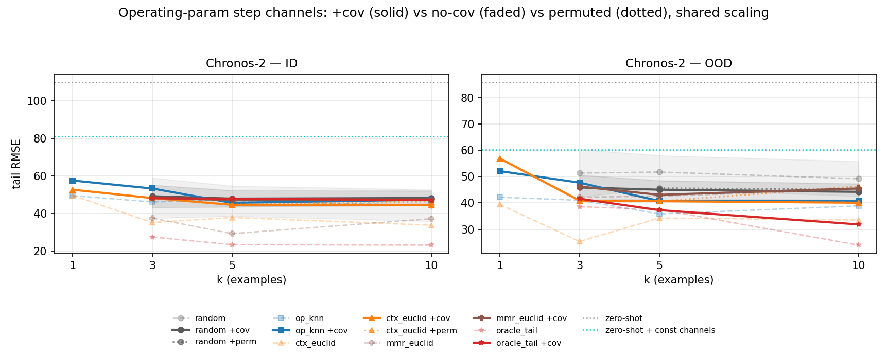
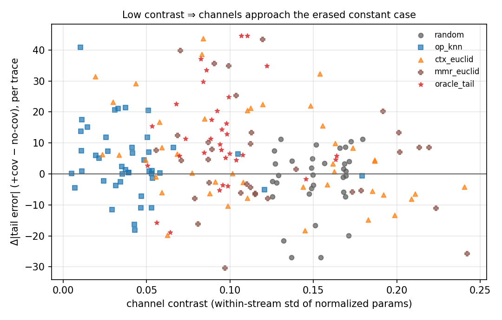
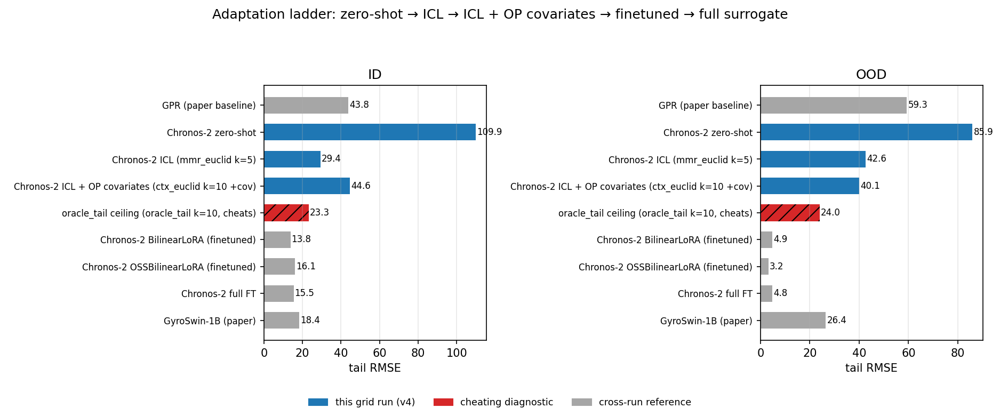

# Training-free operating-parameter conditioning — Phase 4 results

Chronos-2 only (the only benchmarked model with zero-shot covariate support). Protocol: fixed 245-trace pool, full-length example targets (t266), context 80, prediction 64, tail 80, flat concat + SHARED scaling (the Phase-3 winner) for every concat cell. `+cov` adds the 4 operating parameters (q, ŝ, R/L_T, R/L_n) as step-function covariate channels over the ICL stream; `+perm` is the permuted-params control (example params shuffled per example set, query true). Cells are `ID / OOD` tail RMSE; multi-seed cells mean±std (random: 20 seeds, group random: 5), deterministic cells a single pass (seed 42). All cells from ONE grid run (`results/few_shot_v4_covariates/`).

## Anchors — constant channels are degenerate

At k=0 the channels are CONSTANT rows: the per-row instance norm erases the parameter values exactly (smoke S1a), leaving only a float32 rounding tri-state plus the presence of 8 extra rows. The offset below therefore measures presentation perturbation, not conditioning:

| anchor | ID | OOD |
|---|---|---|
| zero-shot (k=0) | 109.91 | 85.86 |
| zero-shot + constant op channels | 81.02 | 60.23 |

## Step-channel conditioning by strategy (concat, shared scaling)

k=1 (where present) is the sign-bit degeneracy diagnostic: the step carries one bit per param. op_knn structurally flattens its own channels (see the contrast column and notes).

### random

| variant | k=1 | k=3 | k=5 | k=10 |
|---|---|---|---|---|
| random | — | 48.36±10.71 / 51.33±8.99 | 46.73±8.05 / 51.71±6.30 | 44.42±8.36 / 49.18±6.63 |
| random +cov | — | 49.27±5.93 / 45.86±4.75 | 48.01±4.35 / 45.02±3.48 | 48.33±3.84 / 44.21±3.08 |
| random +perm | — | — | 47.89±4.59 / 45.62±3.56 | 47.66±4.93 / 45.04±3.06 |

### op_knn

| variant | k=1 | k=3 | k=5 | k=10 |
|---|---|---|---|---|
| op_knn | 49.55 / 42.17 | 46.29 / 41.00 | 47.35 / 35.82 | 47.67 / 38.89 |
| op_knn +cov | 57.64 / 52.07 | 53.39 / 47.70 | 45.78 / 40.75 | 47.47 / 40.71 |

### ctx_euclid

| variant | k=1 | k=3 | k=5 | k=10 |
|---|---|---|---|---|
| ctx_euclid | 49.71 / 39.43 | 35.31 / 25.35 | 37.99 / 34.25 | 33.91 / 33.52 |
| ctx_euclid +cov | 52.75 / 56.89 | 48.32 / 40.88 | 44.71 / 40.67 | 44.61 / 40.08 |
| ctx_euclid +perm | — | — | 44.99 / 40.60 | 46.49 / 46.32 |

### mmr_euclid

| variant | k=1 | k=3 | k=5 | k=10 |
|---|---|---|---|---|
| mmr_euclid | — | 37.66 / 42.18 | 29.40 / 42.56 | 37.32 / 45.11 |
| mmr_euclid +cov | — | 48.36 / 46.21 | 47.30 / 43.07 | 47.59 / 45.50 |

### oracle_tail

| variant | k=1 | k=3 | k=5 | k=10 |
|---|---|---|---|---|
| oracle_tail | — | 27.60 / 38.57 | 23.53 / 37.52 | 23.31 / 23.99 |
| oracle_tail +cov | — | 48.22 / 41.61 | 47.98 / 37.27 | 47.28 / 31.85 |

## Group ICL + constant channels (structural inertness row)

Group mode has no per-example parameter slot; the added channels are per-task constants → value-erased. Identical example sets per pair (hard-asserted); random uses 5 seeds here.

| variant | k=5 | k=10 |
|---|---|---|
| random (group) | 80.48±2.31 / 66.11±5.16 | 77.37±4.71 / 60.83±3.72 |
| random (group +cov) | 79.18±7.14 / 68.81±6.31 | 86.13±3.03 / 65.33±4.72 |
| ctx_euclid (group) | 80.43 / 65.83 | 70.78 / 64.44 |
| ctx_euclid (group +cov) | 85.37 / 70.68 | 89.36 / 66.14 |

## Channel-contrast diagnostic (+cov cells)

Within-stream weighted std of the normalized param channel values (mean over the 4 params, seeds, traces). The per-row norm erases everything but within-row contrast, so low contrast ⇒ the channel approaches the erased constant case. op_knn selects examples with params ≈ the query's — flattening its own channels.

| strategy | k=1 | k=3 | k=5 | k=10 |
|---|---|---|---|---|
| random | — | 0.133 | 0.153 | 0.170 |
| op_knn | 0.015 | 0.039 | 0.048 | 0.065 |
| ctx_euclid | 0.064 | 0.124 | 0.139 | 0.145 |
| mmr_euclid | — | 0.113 | 0.115 | 0.151 |
| oracle_tail | — | 0.091 | 0.095 | 0.098 |

## Paired comparisons (pairing=trace, bootstrap CI primary)

Δ = RMSE(A) − RMSE(B); negative favours A. CI/p from a 10k paired bootstrap over traces; Wilcoxon shown for completeness (p floors 0.031 ID / 0.0625 OOD). `[trace_seed]` rows appear where seed sets are identical.

### Anchor — constant channels (row presence + tri-state artifact)

| A vs B | split | RMSE A | RMSE B | Δ(A−B) | 95% CI | p_boot | p_wilcoxon |
|---|---|---|---|---|---|---|---|
| zeroshot+cov vs zeroshot | ID | 81.02 | 109.91 | -28.88 | [-62.60, -9.90] | 0.000 | 0.031 |
| zeroshot+cov vs zeroshot | OOD | 60.23 | 85.86 | -25.63 | [-44.00, -3.88] | 0.019 | 0.188 |

### Step channels: +cov vs no-cov

| A vs B | split | RMSE A | RMSE B | Δ(A−B) | 95% CI | p_boot | p_wilcoxon |
|---|---|---|---|---|---|---|---|
| random+cov(k=3) vs random(k=3) | ID | 49.61 | 49.47 | +0.14 | [-9.90, 6.13] | 0.911 | 0.562 |
| random+cov(k=3) vs random(k=3) [trace_seed] | ID | 49.61 | 49.47 | +0.14 | [-2.67, 2.87] | 0.918 | 0.457 |
| random+cov(k=3) vs random(k=3) | OOD | 46.10 | 52.07 | -5.98 | [-22.17, 4.67] | 0.486 | 0.438 |
| random+cov(k=3) vs random(k=3) [trace_seed] | OOD | 46.10 | 52.07 | -5.98 | [-10.51, -1.78] | 0.006 | 0.005 |
| random+cov(k=5) vs random(k=5) | ID | 48.20 | 47.38 | +0.82 | [-7.70, 6.71] | 0.746 | 0.562 |
| random+cov(k=5) vs random(k=5) [trace_seed] | ID | 48.20 | 47.38 | +0.82 | [-1.59, 3.19] | 0.500 | 0.225 |
| random+cov(k=5) vs random(k=5) | OOD | 45.15 | 52.08 | -6.93 | [-21.53, 2.74] | 0.469 | 0.438 |
| random+cov(k=5) vs random(k=5) [trace_seed] | OOD | 45.15 | 52.08 | -6.93 | [-10.66, -3.40] | 0.000 | 0.000 |
| random+cov(k=10) vs random(k=10) | ID | 48.48 | 45.16 | +3.32 | [-0.34, 7.39] | 0.111 | 0.312 |
| random+cov(k=10) vs random(k=10) [trace_seed] | ID | 48.48 | 45.16 | +3.32 | [1.52, 5.14] | 0.000 | 0.002 |
| random+cov(k=10) vs random(k=10) | OOD | 44.31 | 49.60 | -5.29 | [-16.29, 1.55] | 0.326 | 0.438 |
| random+cov(k=10) vs random(k=10) [trace_seed] | OOD | 44.31 | 49.60 | -5.29 | [-8.52, -2.19] | 0.001 | 0.000 |
| op_knn+cov(k=1) vs op_knn(k=1) | ID | 57.64 | 49.55 | +8.09 | [-1.56, 22.03] | 0.146 | 0.438 |
| op_knn+cov(k=1) vs op_knn(k=1) | OOD | 52.07 | 42.17 | +9.90 | [6.47, 13.76] | 0.000 | 0.062 |
| op_knn+cov(k=3) vs op_knn(k=3) | ID | 53.39 | 46.29 | +7.11 | [0.54, 14.80] | 0.036 | 0.156 |
| op_knn+cov(k=3) vs op_knn(k=3) | OOD | 47.70 | 41.00 | +6.70 | [-7.95, 16.03] | 0.495 | 0.625 |
| op_knn+cov(k=5) vs op_knn(k=5) | ID | 45.78 | 47.35 | -1.57 | [-6.52, 4.53] | 0.581 | 0.844 |
| op_knn+cov(k=5) vs op_knn(k=5) | OOD | 40.75 | 35.82 | +4.93 | [-13.57, 16.07] | 0.676 | 1.000 |
| op_knn+cov(k=10) vs op_knn(k=10) | ID | 47.47 | 47.67 | -0.19 | [-2.14, 1.60] | 0.811 | 0.844 |
| op_knn+cov(k=10) vs op_knn(k=10) | OOD | 40.71 | 38.89 | +1.83 | [-3.05, 3.98] | 0.281 | 0.438 |
| ctx_euclid+cov(k=1) vs ctx_euclid(k=1) | ID | 52.75 | 49.71 | +3.04 | [-11.10, 15.41] | 0.698 | 1.000 |
| ctx_euclid+cov(k=1) vs ctx_euclid(k=1) | OOD | 56.89 | 39.43 | +17.46 | [2.43, 25.55] | 0.000 | 0.062 |
| ctx_euclid+cov(k=3) vs ctx_euclid(k=3) | ID | 48.32 | 35.31 | +13.01 | [-0.01, 26.02] | 0.053 | 0.219 |
| ctx_euclid+cov(k=3) vs ctx_euclid(k=3) | OOD | 40.88 | 25.35 | +15.53 | [-5.86, 29.47] | 0.437 | 0.812 |
| ctx_euclid+cov(k=5) vs ctx_euclid(k=5) | ID | 44.71 | 37.99 | +6.72 | [-0.50, 13.71] | 0.068 | 0.156 |
| ctx_euclid+cov(k=5) vs ctx_euclid(k=5) | OOD | 40.67 | 34.25 | +6.41 | [-4.90, 13.43] | 0.650 | 0.812 |
| ctx_euclid+cov(k=10) vs ctx_euclid(k=10) | ID | 44.61 | 33.91 | +10.70 | [-2.30, 23.12] | 0.159 | 0.562 |
| ctx_euclid+cov(k=10) vs ctx_euclid(k=10) | OOD | 40.08 | 33.52 | +6.55 | [-8.68, 15.23] | 0.652 | 0.625 |
| mmr_euclid+cov(k=3) vs mmr_euclid(k=3) | ID | 48.36 | 37.66 | +10.69 | [-9.90, 28.33] | 0.307 | 0.688 |
| mmr_euclid+cov(k=3) vs mmr_euclid(k=3) | OOD | 46.21 | 42.18 | +4.04 | [-3.01, 8.78] | 0.286 | 0.625 |
| mmr_euclid+cov(k=5) vs mmr_euclid(k=5) | ID | 47.30 | 29.40 | +17.90 | [-0.99, 33.15] | 0.069 | 0.219 |
| mmr_euclid+cov(k=5) vs mmr_euclid(k=5) | OOD | 43.07 | 42.56 | +0.51 | [-7.37, 5.38] | 0.824 | 0.625 |
| mmr_euclid+cov(k=10) vs mmr_euclid(k=10) | ID | 47.59 | 37.32 | +10.27 | [0.36, 18.65] | 0.040 | 0.156 |
| mmr_euclid+cov(k=10) vs mmr_euclid(k=10) | OOD | 45.50 | 45.11 | +0.39 | [-13.31, 6.54] | 0.956 | 0.812 |
| oracle_tail+cov(k=3) vs oracle_tail(k=3) | ID | 48.22 | 27.60 | +20.62 | [7.62, 28.92] | 0.001 | 0.062 |
| oracle_tail+cov(k=3) vs oracle_tail(k=3) | OOD | 41.61 | 38.57 | +3.04 | [-6.72, 12.40] | 0.378 | 0.438 |
| oracle_tail+cov(k=5) vs oracle_tail(k=5) | ID | 47.98 | 23.53 | +24.45 | [6.30, 35.88] | 0.002 | 0.062 |
| oracle_tail+cov(k=5) vs oracle_tail(k=5) | OOD | 37.27 | 37.52 | -0.24 | [-13.81, 5.15] | 0.891 | 0.625 |
| oracle_tail+cov(k=10) vs oracle_tail(k=10) | ID | 47.28 | 23.31 | +23.97 | [8.10, 35.01] | 0.000 | 0.062 |
| oracle_tail+cov(k=10) vs oracle_tail(k=10) | OOD | 31.85 | 23.99 | +7.86 | [2.50, 12.81] | 0.001 | 0.125 |

### Attribution — permuted-params control

| A vs B | split | RMSE A | RMSE B | Δ(A−B) | 95% CI | p_boot | p_wilcoxon |
|---|---|---|---|---|---|---|---|
| random+cov(k=5) vs random+perm(k=5) | ID | 48.20 | 48.10 | +0.10 | [-0.51, 1.44] | 0.778 | 0.844 |
| random+cov(k=5) vs random+perm(k=5) [trace_seed] | ID | 48.20 | 48.10 | +0.10 | [-0.66, 0.92] | 0.785 | 0.527 |
| random+cov(k=5) vs random+perm(k=5) | OOD | 45.15 | 45.75 | -0.60 | [-0.93, 0.28] | 0.099 | 0.312 |
| random+cov(k=5) vs random+perm(k=5) [trace_seed] | OOD | 45.15 | 45.75 | -0.60 | [-1.94, 0.51] | 0.351 | 0.769 |
| random+perm(k=5) vs random(k=5) | ID | 48.10 | 47.38 | +0.72 | [-8.33, 6.92] | 0.751 | 0.562 |
| random+perm(k=5) vs random(k=5) [trace_seed] | ID | 48.10 | 47.38 | +0.72 | [-1.83, 3.17] | 0.584 | 0.478 |
| random+perm(k=5) vs random(k=5) | OOD | 45.75 | 52.08 | -6.33 | [-20.93, 3.61] | 0.495 | 0.438 |
| random+perm(k=5) vs random(k=5) [trace_seed] | OOD | 45.75 | 52.08 | -6.33 | [-10.17, -2.70] | 0.000 | 0.000 |
| random+cov(k=10) vs random+perm(k=10) | ID | 48.48 | 47.90 | +0.58 | [-0.88, 2.25] | 0.440 | 0.438 |
| random+cov(k=10) vs random+perm(k=10) [trace_seed] | ID | 48.48 | 47.90 | +0.58 | [-0.22, 1.43] | 0.155 | 0.098 |
| random+cov(k=10) vs random+perm(k=10) | OOD | 44.31 | 45.13 | -0.82 | [-3.25, 0.62] | 0.452 | 0.438 |
| random+cov(k=10) vs random+perm(k=10) [trace_seed] | OOD | 44.31 | 45.13 | -0.82 | [-2.17, 0.47] | 0.208 | 0.276 |
| random+perm(k=10) vs random(k=10) | ID | 47.90 | 45.16 | +2.74 | [-2.05, 6.44] | 0.288 | 0.438 |
| random+perm(k=10) vs random(k=10) [trace_seed] | ID | 47.90 | 45.16 | +2.74 | [0.91, 4.58] | 0.003 | 0.011 |
| random+perm(k=10) vs random(k=10) | OOD | 45.13 | 49.60 | -4.47 | [-13.07, 0.93] | 0.268 | 0.438 |
| random+perm(k=10) vs random(k=10) [trace_seed] | OOD | 45.13 | 49.60 | -4.47 | [-7.38, -1.66] | 0.001 | 0.001 |
| ctx_euclid+cov(k=5) vs ctx_euclid+perm(k=5) | ID | 44.71 | 44.99 | -0.28 | [-3.66, 2.04] | 0.708 | 0.438 |
| ctx_euclid+cov(k=5) vs ctx_euclid+perm(k=5) | OOD | 40.67 | 40.60 | +0.07 | [-16.19, 5.93] | 0.963 | 1.000 |
| ctx_euclid+perm(k=5) vs ctx_euclid(k=5) | ID | 44.99 | 37.99 | +7.00 | [1.07, 15.61] | 0.012 | 0.156 |
| ctx_euclid+perm(k=5) vs ctx_euclid(k=5) | OOD | 40.60 | 34.25 | +6.34 | [-3.40, 14.26] | 0.164 | 0.812 |
| ctx_euclid+cov(k=10) vs ctx_euclid+perm(k=10) | ID | 44.61 | 46.49 | -1.88 | [-7.63, 1.37] | 0.281 | 0.438 |
| ctx_euclid+cov(k=10) vs ctx_euclid+perm(k=10) | OOD | 40.08 | 46.32 | -6.24 | [-21.24, -2.36] | 0.001 | 0.125 |
| ctx_euclid+perm(k=10) vs ctx_euclid(k=10) | ID | 46.49 | 33.91 | +12.59 | [-1.24, 23.83] | 0.082 | 0.219 |
| ctx_euclid+perm(k=10) vs ctx_euclid(k=10) | OOD | 46.32 | 33.52 | +12.79 | [1.00, 19.60] | 0.019 | 0.312 |

### Selection-conditioning vs covariate-conditioning

| A vs B | split | RMSE A | RMSE B | Δ(A−B) | 95% CI | p_boot | p_wilcoxon |
|---|---|---|---|---|---|---|---|
| op_knn(k=3) vs random+cov(k=3) | ID | 46.29 | 49.61 | -3.32 | [-14.16, 9.46] | 0.710 | 0.312 |
| op_knn(k=3) vs random+cov(k=3) | OOD | 41.00 | 46.10 | -5.10 | [-8.14, -0.88] | 0.019 | 0.188 |
| op_knn(k=5) vs random+cov(k=5) | ID | 47.35 | 48.20 | -0.85 | [-10.29, 9.68] | 0.774 | 0.562 |
| op_knn(k=5) vs random+cov(k=5) | OOD | 35.82 | 45.15 | -9.33 | [-15.07, 2.83] | 0.128 | 0.312 |
| op_knn(k=10) vs random+cov(k=10) | ID | 47.67 | 48.48 | -0.81 | [-8.80, 5.43] | 0.873 | 1.000 |
| op_knn(k=10) vs random+cov(k=10) | OOD | 38.89 | 44.31 | -5.42 | [-11.94, 1.85] | 0.089 | 0.312 |

### Group block — constant channels in group mode

| A vs B | split | RMSE A | RMSE B | Δ(A−B) | 95% CI | p_boot | p_wilcoxon |
|---|---|---|---|---|---|---|---|
| random group+cov(k=5) vs group(k=5) | ID | 79.43 | 80.50 | -1.07 | [-4.44, 3.84] | 0.603 | 0.844 |
| random group+cov(k=5) vs group(k=5) [trace_seed] | ID | 79.43 | 80.50 | -1.07 | [-4.99, 2.88] | 0.591 | 0.919 |
| random group+cov(k=5) vs group(k=5) | OOD | 69.04 | 66.27 | +2.77 | [-0.04, 5.64] | 0.053 | 0.312 |
| random group+cov(k=5) vs group(k=5) [trace_seed] | OOD | 69.04 | 66.27 | +2.77 | [-0.68, 6.15] | 0.118 | 0.182 |
| random group+cov(k=10) vs group(k=10) | ID | 86.18 | 77.49 | +8.69 | [5.27, 11.80] | 0.000 | 0.062 |
| random group+cov(k=10) vs group(k=10) [trace_seed] | ID | 86.18 | 77.49 | +8.69 | [4.70, 12.07] | 0.000 | 0.000 |
| random group+cov(k=10) vs group(k=10) | OOD | 65.46 | 60.92 | +4.54 | [0.76, 9.81] | 0.019 | 0.312 |
| random group+cov(k=10) vs group(k=10) [trace_seed] | OOD | 65.46 | 60.92 | +4.54 | [2.16, 7.23] | 0.000 | 0.003 |
| ctx_euclid group+cov(k=5) vs group(k=5) | ID | 85.37 | 80.43 | +4.95 | [-7.50, 14.11] | 0.408 | 0.438 |
| ctx_euclid group+cov(k=5) vs group(k=5) | OOD | 70.68 | 65.83 | +4.84 | [-0.72, 12.49] | 0.102 | 0.438 |
| ctx_euclid group+cov(k=10) vs group(k=10) | ID | 89.36 | 70.78 | +18.58 | [7.27, 29.48] | 0.000 | 0.031 |
| ctx_euclid group+cov(k=10) vs group(k=10) | OOD | 66.14 | 64.44 | +1.70 | [-5.65, 7.25] | 0.543 | 0.625 |

### Headline

| A vs B | split | RMSE A | RMSE B | Δ(A−B) | 95% CI | p_boot | p_wilcoxon |
|---|---|---|---|---|---|---|---|
| best legit +cov [ctx_euclid k=10 +cov] vs best legit no-cov [mmr_euclid k=5] | ID | 44.61 | 29.40 | +15.21 | [-1.56, 33.54] | 0.091 | 0.219 |
| best legit +cov [ctx_euclid k=10 +cov] vs best legit no-cov [mmr_euclid k=5] | OOD | 40.08 | 42.56 | -2.48 | [-23.28, 6.10] | 0.715 | 0.438 |
| best legit v4 [mmr_euclid k=5] vs zero-shot | ID | 29.40 | 109.91 | -80.51 | [-99.94, -58.38] | 0.000 | 0.031 |
| best legit v4 [mmr_euclid k=5] vs zero-shot | OOD | 42.56 | 85.86 | -43.30 | [-63.92, -8.22] | 0.017 | 0.188 |

## Adaptation ladder (the bridge table)

Ordered by adaptation cost. v4 rows come from this grid run; reference rows are cross-run/cross-pipeline context (GyroSwin paper arXiv:2510.07314; Severin's finetuning results in this repo's README) — same 11 benchmark traces and tail-RMSE metric, but not cell-to-cell comparable with v4 (different runs).

| rung | adaptation cost | ID | OOD | source |
|---|---|---|---|---|
| GPR (paper baseline) | classical surrogate | 43.82 | 59.28 | cross-run reference |
| Chronos-2 zero-shot | none | 109.91 | 85.86 | this run |
| Chronos-2 ICL (mmr_euclid k=5) | in-context examples | 29.40 | 42.56 | this run |
| Chronos-2 ICL + OP covariates (ctx_euclid k=10 +cov) | + op-param channels | 44.61 | 40.08 | this run |
| oracle_tail ceiling (oracle_tail k=10, cheats) | label-aware (diagnostic) | 23.31 | 23.99 | this run (cheats) |
| Chronos-2 BilinearLoRA (finetuned) | finetuning | 13.83 | 4.86 | cross-run reference |
| Chronos-2 OSSBilinearLoRA (finetuned) | finetuning | 16.11 | 3.19 | cross-run reference |
| Chronos-2 full FT | finetuning | 15.50 | 4.76 | cross-run reference |
| GyroSwin-1B (paper) | full surrogate training | 18.35 | 26.43 | cross-run reference |

## Interpretation notes

- **Why step channels (and not constant covariates).** Chronos-2
  instance-norms every variate row INDEPENDENTLY (loc=nanmean, scale=RMS,
  + arcsinh; positive-affine invariant), so only within-row relative
  geometry survives. A constant channel has its VALUE erased exactly —
  smoke S1a showed two different param values engineered to share the
  post-norm rows give bit-identical forecasts — surviving only as a
  float32 tri-state rounding artifact (all-0/±1) that nonetheless shifts
  the rollout (~16% rel L2 at k=0): constant channels inject
  value-uncorrelated perturbation, not information. That is what the
  zeroshot+cov anchor row measures. Static params can therefore act ONLY
  via within-row contrast: example i's params over its segment, the
  query's over the query segment.
- **Relative-only ceiling.** Absolute parameter values cannot survive the
  per-row norm under any encoding — this is training-free *relative*
  conditioning. At k=1 the step degenerates to one sign bit per param
  (two values over ~equal supports normalize to ±1 regardless of the
  values) — the k=1 diagnostic block quantifies that floor.
- **op_knn is structurally confounded with the channels.** Selecting
  examples whose params are close to the query's re-flattens the step
  channel toward a constant (the erased case). The channel-contrast
  column makes this visible: op_knn sits at the low-contrast pole, so
  "op_knn + cov" cannot separate selection-conditioning from
  covariate-conditioning. Use random/ctx_euclid +cov for attribution.
- **Permuted-params control.** +cov differing from no-cov only shows that
  extra rows change the model's behaviour; +cov separating from +perm
  (same rows, example params shuffled, query true) is what attributes a
  gain to parameter INFORMATION. A +cov gain without permcov separation
  is presentation noise.
- **Group+cov is structurally degenerate by construction**: group mode has
  no per-example slot (each example IS a row), and the added per-task
  constant channels are value-erased as above. The group block is the
  empirical row for that claim.
- **Context clamp.** At k=10 the concat stream is ~2750 steps; Chronos-2
  left-clamps ALL rows (target + channels, one index range — alignment
  safe) to 2048, so k=10 cells partially measure the context window, the
  same caveat class as Phase 3.
- MPS is not bit-deterministic across process runs: headline comparisons
  live within the single v4 grid run; ladder reference rows are cross-run
  context with provenance noted.
- Wilcoxon p floors at 0.031 (n=6 ID) / 0.0625 (n=5 OOD) under
  pairing="trace"; the bootstrap CI is the primary evidence. Where seed
  sets are identical multi-seed, a pairing="trace_seed" row adds
  resolution but treats seeds as independent.
