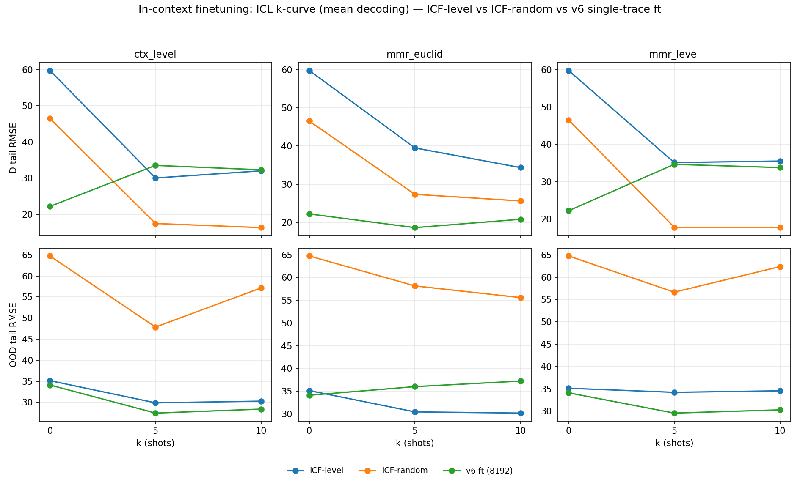

# In-context finetuning — Phase 9 results (does training on demonstrations beat inherited ICL?)

The v6 finetuned model's in-context ability is INHERITED from base pretraining — it was finetuned on single traces. Phase 9 trains the SAME BilinearLoRA recipe ON multi-example ICL concatenations (`Chronos2ICLDataset`, window 2048, k∈{1,3,5} per sample, query-only conditioning) with two retrieval modes:

- **ICF-level** (`lora_weights.pt@4d2f4068e6e8`): demos retrieved by context level during training (train≡test `ctx_level`).
- **ICF-random** (`lora_weights.pt@d3e283c58b89`): demos sampled at random — the control that probes whether the model learned to USE level-matched demos or merely tolerate demonstrations.

Both are evaluated at their 2048 training window through the frozen shared-scaling rollout; the v6 single-trace ft model (the inherited-ICL baseline) is shown at its full (8192) window. Each finetuned model is at its own natural window. n=6 ID / 5 OOD traces.

## Three-way — headline (mean decoding)

| model | k=0 (zero-shot) | best legit ICL | config |
|---|---|---|---|
| ICF-level | 59.76 / 35.13 | 30.07 / 29.86 | ctx_level k=5 |
| ICF-random | 46.52 / 64.76 | 16.35 / 57.17 | ctx_level k=10 |
| v6 single-trace ft (8192 win) | 22.20 / 34.10 | 18.62 / 36.00 | mmr_euclid k=5 |

Cells are `ID / OOD` tail RMSE (±std over seeds where multi-seed).

## Three-way — appendix (median decoding)

| model | k=0 (zero-shot) | best legit ICL | config |
|---|---|---|---|
| ICF-level | 80.22 / 53.65 | 34.47 / 30.82 | ctx_level k=5 |
| ICF-random | 60.42 / 44.28 | 20.38 / 50.11 | ctx_level k=10 |
| v6 single-trace ft (8192 win) | 25.33 / 33.03 | 26.10 / 36.36 | mmr_euclid k=5 |

Cells are `ID / OOD` tail RMSE (±std over seeds where multi-seed).

## Full grid — ICF-level vs ICF-random vs v6 ft per config

### Decoding: mean

| config | ICF-level | ICF-random | v6 ft (8192) | Δ level−random (ID) | Δ level−v6 (ID) |
|---|---|---|---|---|---|
| zeroshot k=0 | 59.76 / 35.13 | 46.52 / 64.76 | 22.20 / 34.10 | +13.24 | +37.56 |
| ctx_level k=5 | 30.07 / 29.86 | 17.49 / 47.86 | 33.54 / 27.42 | +12.57 | -3.48 |
| ctx_level k=10 | 32.04 / 30.26 | 16.35 / 57.17 | 32.32 / 28.37 | +15.69 | -0.27 |
| mmr_euclid k=5 | 39.49 / 30.44 | 27.33 / 58.16 | 18.62 / 36.00 | +12.15 | +20.87 |
| mmr_euclid k=10 | 34.33 / 30.18 | 25.60 / 55.59 | 20.80 / 37.22 | +8.73 | +13.53 |
| mmr_level k=5 | 35.11 / 34.22 | 17.78 / 56.65 | 34.64 / 29.57 | +17.33 | +0.47 |
| mmr_level k=10 | 35.51 / 34.56 | 17.69 / 62.36 | 33.77 / 30.29 | +17.82 | +1.74 |
| oracle_tail k=10 (cheats) | 22.20 / 7.49 | 32.80 / 61.82 | 9.39 / 10.89 | -10.60 | +12.81 |
| random k=10 | 30.38±6.64 / 42.72±5.24 | 20.43±5.25 / 51.25±4.93 | 38.87±9.79 / 46.23±8.15 | +9.95 | -8.49 |

### Decoding: median

| config | ICF-level | ICF-random | v6 ft (8192) | Δ level−random (ID) | Δ level−v6 (ID) |
|---|---|---|---|---|---|
| zeroshot k=0 | 80.22 / 53.65 | 60.42 / 44.28 | 25.33 / 33.03 | +19.80 | +54.88 |
| ctx_level k=5 | 34.47 / 30.82 | 21.46 / 41.99 | 39.40 / 29.85 | +13.02 | -4.93 |
| ctx_level k=10 | 36.46 / 32.60 | 20.38 / 50.11 | 38.81 / 30.20 | +16.08 | -2.36 |
| mmr_euclid k=5 | 41.47 / 29.29 | 32.55 / 51.73 | 26.10 / 36.36 | +8.92 | +15.38 |
| mmr_euclid k=10 | 38.45 / 30.69 | 31.08 / 49.64 | 29.13 / 38.15 | +7.36 | +9.31 |
| mmr_level k=5 | 38.60 / 34.41 | 23.97 / 50.33 | 40.31 / 32.59 | +14.63 | -1.72 |
| mmr_level k=10 | 40.09 / 35.31 | 22.75 / 56.37 | 40.18 / 33.24 | +17.33 | -0.09 |
| oracle_tail k=10 (cheats) | 29.88 / 2.78 | 37.24 / 54.51 | 16.72 / 15.25 | -7.36 | +13.17 |
| random k=10 | 34.98±5.69 / 44.04±5.29 | 25.70±5.82 / 46.87±4.70 | 44.58±11.04 / 49.82±9.91 | +9.28 | -9.60 |

## Paired comparisons

Δ = RMSE(A) − RMSE(B); negative favours A. CI/p from a 10k paired bootstrap over traces; `[trace_seed]` rows for the 20-seed random cells. Three questions: **L vs R** (did ICF learn to USE level-matched demos — is the level checkpoint better than the random control at the same eval config?); **+ICL vs k0** (does ICL help each checkpoint over its own zero-shot?); **L vs v6** (does demonstration-training beat the v6 inherited-ICL model?).

| A vs B | split | RMSE A | RMSE B | Δ(A−B) | 95% CI | p_boot | p_wilcoxon |
|---|---|---|---|---|---|---|---|
| [mean] k0: ICF-level vs ICF-random | ID | 59.76 | 46.52 | +13.24 | [-6.47, 44.01] | 0.369 | 1.000 |
| [mean] k0: ICF-level vs ICF-random | OOD | 35.13 | 64.76 | -29.63 | [-78.84, 8.97] | 0.475 | 0.625 |
| [mean] ctx_level k=5: L vs R | ID | 30.07 | 17.49 | +12.57 | [1.56, 22.05] | 0.032 | 0.438 |
| [mean] ctx_level k=5: L vs R | OOD | 29.86 | 47.86 | -18.00 | [-55.31, 7.53] | 0.430 | 0.812 |
| [mean] ctx_level k=5: L+ICL vs L k0 | ID | 30.07 | 59.76 | -29.69 | [-44.37, -7.46] | 0.012 | 0.156 |
| [mean] ctx_level k=5: L+ICL vs L k0 | OOD | 29.86 | 35.13 | -5.27 | [-15.41, 2.44] | 0.139 | 0.312 |
| [mean] ctx_level k=5: R+ICL vs R k0 | ID | 17.49 | 46.52 | -29.03 | [-49.02, -5.66] | 0.000 | 0.031 |
| [mean] ctx_level k=5: R+ICL vs R k0 | OOD | 47.86 | 64.76 | -16.90 | [-29.45, 1.69] | 0.101 | 0.312 |
| [mean] ctx_level k=5: L vs v6 ft | ID | 30.07 | 33.54 | -3.48 | [-10.48, 4.21] | 0.584 | 1.000 |
| [mean] ctx_level k=5: L vs v6 ft | OOD | 29.86 | 27.42 | +2.43 | [-0.19, 6.84] | 0.058 | 0.312 |
| [mean] ctx_level k=10: L vs R | ID | 32.04 | 16.35 | +15.69 | [0.61, 26.15] | 0.041 | 0.438 |
| [mean] ctx_level k=10: L vs R | OOD | 30.26 | 57.17 | -26.91 | [-76.06, 13.72] | 0.499 | 0.812 |
| [mean] ctx_level k=10: L+ICL vs L k0 | ID | 32.04 | 59.76 | -27.72 | [-41.06, -9.95] | 0.003 | 0.094 |
| [mean] ctx_level k=10: L+ICL vs L k0 | OOD | 30.26 | 35.13 | -4.87 | [-11.16, -1.06] | 0.022 | 0.188 |
| [mean] ctx_level k=10: R+ICL vs R k0 | ID | 16.35 | 46.52 | -30.17 | [-52.16, -5.77] | 0.000 | 0.062 |
| [mean] ctx_level k=10: R+ICL vs R k0 | OOD | 57.17 | 64.76 | -7.59 | [-14.72, 0.10] | 0.052 | 0.188 |
| [mean] ctx_level k=10: L vs v6 ft | ID | 32.04 | 32.32 | -0.27 | [-3.00, 3.37] | 0.915 | 1.000 |
| [mean] ctx_level k=10: L vs v6 ft | OOD | 30.26 | 28.37 | +1.89 | [-3.04, 7.81] | 0.333 | 0.625 |
| [mean] mmr_euclid k=5: L vs R | ID | 39.49 | 27.33 | +12.15 | [-0.39, 25.70] | 0.059 | 0.312 |
| [mean] mmr_euclid k=5: L vs R | OOD | 30.44 | 58.16 | -27.72 | [-67.87, 13.51] | 0.244 | 0.625 |
| [mean] mmr_euclid k=5: L+ICL vs L k0 | ID | 39.49 | 59.76 | -20.27 | [-32.08, 0.60] | 0.056 | 0.219 |
| [mean] mmr_euclid k=5: L+ICL vs L k0 | OOD | 30.44 | 35.13 | -4.68 | [-13.21, 5.63] | 0.429 | 0.625 |
| [mean] mmr_euclid k=5: R+ICL vs R k0 | ID | 27.33 | 46.52 | -19.18 | [-32.16, -0.63] | 0.035 | 0.156 |
| [mean] mmr_euclid k=5: R+ICL vs R k0 | OOD | 58.16 | 64.76 | -6.59 | [-15.01, 7.81] | 0.413 | 0.812 |
| [mean] mmr_euclid k=5: L vs v6 ft | ID | 39.49 | 18.62 | +20.87 | [5.50, 34.09] | 0.000 | 0.062 |
| [mean] mmr_euclid k=5: L vs v6 ft | OOD | 30.44 | 36.00 | -5.55 | [-12.80, 1.03] | 0.069 | 0.312 |
| [mean] mmr_euclid k=10: L vs R | ID | 34.33 | 25.60 | +8.73 | [-0.73, 19.29] | 0.081 | 0.438 |
| [mean] mmr_euclid k=10: L vs R | OOD | 30.18 | 55.59 | -25.42 | [-61.83, 12.69] | 0.225 | 0.625 |
| [mean] mmr_euclid k=10: L+ICL vs L k0 | ID | 34.33 | 59.76 | -25.43 | [-37.66, -5.06] | 0.024 | 0.219 |
| [mean] mmr_euclid k=10: L+ICL vs L k0 | OOD | 30.18 | 35.13 | -4.95 | [-12.96, 4.58] | 0.450 | 0.812 |
| [mean] mmr_euclid k=10: R+ICL vs R k0 | ID | 25.60 | 46.52 | -20.91 | [-34.95, -1.24] | 0.034 | 0.156 |
| [mean] mmr_euclid k=10: R+ICL vs R k0 | OOD | 55.59 | 64.76 | -9.16 | [-19.34, 7.04] | 0.370 | 0.812 |
| [mean] mmr_euclid k=10: L vs v6 ft | ID | 34.33 | 20.80 | +13.53 | [2.70, 22.96] | 0.002 | 0.062 |
| [mean] mmr_euclid k=10: L vs v6 ft | OOD | 30.18 | 37.22 | -7.05 | [-15.84, 1.04] | 0.103 | 0.312 |
| [mean] mmr_level k=5: L vs R | ID | 35.11 | 17.78 | +17.33 | [-1.53, 29.05] | 0.129 | 0.438 |
| [mean] mmr_level k=5: L vs R | OOD | 34.22 | 56.65 | -22.43 | [-64.84, 6.48] | 0.660 | 0.625 |
| [mean] mmr_level k=5: L+ICL vs L k0 | ID | 35.11 | 59.76 | -24.65 | [-35.85, -13.66] | 0.000 | 0.031 |
| [mean] mmr_level k=5: L+ICL vs L k0 | OOD | 34.22 | 35.13 | -0.91 | [-9.36, 14.54] | 0.882 | 0.812 |
| [mean] mmr_level k=5: R+ICL vs R k0 | ID | 17.78 | 46.52 | -28.74 | [-47.73, -7.10] | 0.000 | 0.031 |
| [mean] mmr_level k=5: R+ICL vs R k0 | OOD | 56.65 | 64.76 | -8.11 | [-15.75, 4.77] | 0.188 | 0.625 |
| [mean] mmr_level k=5: L vs v6 ft | ID | 35.11 | 34.64 | +0.47 | [-5.39, 4.43] | 0.858 | 0.688 |
| [mean] mmr_level k=5: L vs v6 ft | OOD | 34.22 | 29.57 | +4.65 | [-2.85, 20.41] | 0.311 | 0.312 |
| [mean] mmr_level k=10: L vs R | ID | 35.51 | 17.69 | +17.82 | [-1.52, 30.65] | 0.101 | 0.438 |
| [mean] mmr_level k=10: L vs R | OOD | 34.56 | 62.36 | -27.80 | [-77.69, 11.68] | 0.618 | 1.000 |
| [mean] mmr_level k=10: L+ICL vs L k0 | ID | 35.51 | 59.76 | -24.25 | [-36.77, -11.97] | 0.000 | 0.062 |
| [mean] mmr_level k=10: L+ICL vs L k0 | OOD | 34.56 | 35.13 | -0.57 | [-7.32, 9.44] | 0.786 | 0.625 |
| [mean] mmr_level k=10: R+ICL vs R k0 | ID | 17.69 | 46.52 | -28.83 | [-49.82, -5.23] | 0.000 | 0.062 |
| [mean] mmr_level k=10: R+ICL vs R k0 | OOD | 62.36 | 64.76 | -2.40 | [-14.08, 2.90] | 0.385 | 0.438 |
| [mean] mmr_level k=10: L vs v6 ft | ID | 35.51 | 33.77 | +1.74 | [-2.66, 3.93] | 0.250 | 1.000 |
| [mean] mmr_level k=10: L vs v6 ft | OOD | 34.56 | 30.29 | +4.27 | [-0.69, 15.60] | 0.102 | 0.312 |
| [mean] oracle_tail k=10: L vs R | ID | 22.20 | 32.80 | -10.60 | [-16.44, -0.73] | 0.042 | 0.219 |
| [mean] oracle_tail k=10: L vs R | OOD | 7.49 | 61.82 | -54.32 | [-85.63, -11.55] | 0.000 | 0.062 |
| [mean] oracle_tail k=10: L+ICL vs L k0 | ID | 22.20 | 59.76 | -37.56 | [-52.64, -17.68] | 0.000 | 0.062 |
| [mean] oracle_tail k=10: L+ICL vs L k0 | OOD | 7.49 | 35.13 | -27.63 | [-46.73, -3.88] | 0.000 | 0.062 |
| [mean] oracle_tail k=10: R+ICL vs R k0 | ID | 32.80 | 46.52 | -13.72 | [-25.77, 5.55] | 0.164 | 0.219 |
| [mean] oracle_tail k=10: R+ICL vs R k0 | OOD | 61.82 | 64.76 | -2.94 | [-13.20, 13.89] | 0.673 | 0.812 |
| [mean] oracle_tail k=10: L vs v6 ft | ID | 22.20 | 9.39 | +12.81 | [2.68, 20.72] | 0.015 | 0.156 |
| [mean] oracle_tail k=10: L vs v6 ft | OOD | 7.49 | 10.89 | -3.39 | [-4.54, -2.73] | 0.000 | 0.062 |
| [mean] random k=10: L vs R | ID | 31.06 | 21.06 | +10.00 | [1.62, 18.83] | 0.023 | 0.156 |
| [mean] random k=10: L vs R [trace_seed] | ID | 31.06 | 21.06 | +10.00 | [6.49, 13.47] | 0.000 | 0.000 |
| [mean] random k=10: L vs R | OOD | 43.02 | 51.47 | -8.45 | [-26.76, 11.15] | 0.659 | 0.812 |
| [mean] random k=10: L vs R [trace_seed] | OOD | 43.02 | 51.47 | -8.45 | [-15.09, -1.89] | 0.013 | 0.538 |
| [mean] random k=10: L vs v6 ft | ID | 31.06 | 40.02 | -8.96 | [-11.03, -7.07] | 0.000 | 0.031 |
| [mean] random k=10: L vs v6 ft [trace_seed] | ID | 31.06 | 40.02 | -8.96 | [-11.81, -6.05] | 0.000 | 0.000 |
| [mean] random k=10: L vs v6 ft | OOD | 43.02 | 46.91 | -3.89 | [-9.77, 6.46] | 0.375 | 0.812 |
| [mean] random k=10: L vs v6 ft [trace_seed] | OOD | 43.02 | 46.91 | -3.89 | [-7.00, -0.68] | 0.017 | 0.093 |
| [median] k0: ICF-level vs ICF-random | ID | 80.22 | 60.42 | +19.80 | [-0.75, 51.28] | 0.077 | 0.312 |
| [median] k0: ICF-level vs ICF-random | OOD | 53.65 | 44.28 | +9.37 | [-30.09, 40.42] | 0.598 | 0.625 |
| [median] ctx_level k=5: L vs R | ID | 34.47 | 21.46 | +13.02 | [1.99, 25.81] | 0.024 | 0.219 |
| [median] ctx_level k=5: L vs R | OOD | 30.82 | 41.99 | -11.17 | [-44.23, 6.42] | 0.535 | 0.625 |
| [median] ctx_level k=5: L+ICL vs L k0 | ID | 34.47 | 80.22 | -45.74 | [-62.46, -23.05] | 0.000 | 0.031 |
| [median] ctx_level k=5: L+ICL vs L k0 | OOD | 30.82 | 53.65 | -22.83 | [-47.83, -3.79] | 0.018 | 0.188 |
| [median] ctx_level k=5: R+ICL vs R k0 | ID | 21.46 | 60.42 | -38.96 | [-57.54, -15.29] | 0.000 | 0.031 |
| [median] ctx_level k=5: R+ICL vs R k0 | OOD | 41.99 | 44.28 | -2.29 | [-5.85, 1.30] | 0.159 | 0.312 |
| [median] ctx_level k=5: L vs v6 ft | ID | 34.47 | 39.40 | -4.93 | [-12.62, 3.15] | 0.346 | 0.562 |
| [median] ctx_level k=5: L vs v6 ft | OOD | 30.82 | 29.85 | +0.97 | [0.15, 4.95] | 0.010 | 0.125 |
| [median] ctx_level k=10: L vs R | ID | 36.46 | 20.38 | +16.08 | [0.34, 27.76] | 0.048 | 0.219 |
| [median] ctx_level k=10: L vs R | OOD | 32.60 | 50.11 | -17.51 | [-62.64, 13.90] | 0.588 | 1.000 |
| [median] ctx_level k=10: L+ICL vs L k0 | ID | 36.46 | 80.22 | -43.76 | [-59.86, -25.15] | 0.000 | 0.031 |
| [median] ctx_level k=10: L+ICL vs L k0 | OOD | 32.60 | 53.65 | -21.05 | [-46.41, -1.03] | 0.033 | 0.188 |
| [median] ctx_level k=10: R+ICL vs R k0 | ID | 20.38 | 60.42 | -40.04 | [-60.64, -14.13] | 0.000 | 0.031 |
| [median] ctx_level k=10: R+ICL vs R k0 | OOD | 50.11 | 44.28 | +5.83 | [-10.35, 19.52] | 0.658 | 1.000 |
| [median] ctx_level k=10: L vs v6 ft | ID | 36.46 | 38.81 | -2.36 | [-5.44, 1.69] | 0.223 | 0.312 |
| [median] ctx_level k=10: L vs v6 ft | OOD | 32.60 | 30.20 | +2.40 | [1.07, 9.09] | 0.000 | 0.125 |
| [median] mmr_euclid k=5: L vs R | ID | 41.47 | 32.55 | +8.92 | [-1.35, 20.05] | 0.065 | 0.312 |
| [median] mmr_euclid k=5: L vs R | OOD | 29.29 | 51.73 | -22.44 | [-55.50, 11.98] | 0.230 | 0.438 |
| [median] mmr_euclid k=5: L+ICL vs L k0 | ID | 41.47 | 80.22 | -38.75 | [-55.04, -15.13] | 0.001 | 0.062 |
| [median] mmr_euclid k=5: L+ICL vs L k0 | OOD | 29.29 | 53.65 | -24.36 | [-47.57, 10.86] | 0.119 | 0.312 |
| [median] mmr_euclid k=5: R+ICL vs R k0 | ID | 32.55 | 60.42 | -27.87 | [-43.73, -5.93] | 0.008 | 0.094 |
| [median] mmr_euclid k=5: R+ICL vs R k0 | OOD | 51.73 | 44.28 | +7.45 | [-2.48, 14.96] | 0.179 | 0.625 |
| [median] mmr_euclid k=5: L vs v6 ft | ID | 41.47 | 26.10 | +15.38 | [2.94, 24.46] | 0.011 | 0.156 |
| [median] mmr_euclid k=5: L vs v6 ft | OOD | 29.29 | 36.36 | -7.07 | [-18.45, 5.11] | 0.210 | 0.625 |
| [median] mmr_euclid k=10: L vs R | ID | 38.45 | 31.08 | +7.36 | [-0.47, 16.77] | 0.064 | 0.219 |
| [median] mmr_euclid k=10: L vs R | OOD | 30.69 | 49.64 | -18.95 | [-43.45, 12.32] | 0.230 | 0.438 |
| [median] mmr_euclid k=10: L+ICL vs L k0 | ID | 38.45 | 80.22 | -41.77 | [-58.55, -18.93] | 0.000 | 0.031 |
| [median] mmr_euclid k=10: L+ICL vs L k0 | OOD | 30.69 | 53.65 | -22.96 | [-44.55, 12.51] | 0.122 | 0.438 |
| [median] mmr_euclid k=10: R+ICL vs R k0 | ID | 31.08 | 60.42 | -29.33 | [-46.08, -6.85] | 0.008 | 0.094 |
| [median] mmr_euclid k=10: R+ICL vs R k0 | OOD | 49.64 | 44.28 | +5.36 | [-2.96, 10.67] | 0.179 | 0.312 |
| [median] mmr_euclid k=10: L vs v6 ft | ID | 38.45 | 29.13 | +9.31 | [1.21, 15.39] | 0.010 | 0.156 |
| [median] mmr_euclid k=10: L vs v6 ft | OOD | 30.69 | 38.15 | -7.47 | [-15.60, 5.70] | 0.200 | 0.625 |
| [median] mmr_level k=5: L vs R | ID | 38.60 | 23.97 | +14.63 | [-0.78, 27.16] | 0.074 | 0.312 |
| [median] mmr_level k=5: L vs R | OOD | 34.41 | 50.33 | -15.93 | [-50.63, 12.14] | 0.660 | 0.625 |
| [median] mmr_level k=5: L+ICL vs L k0 | ID | 38.60 | 80.22 | -41.62 | [-56.65, -24.88] | 0.000 | 0.031 |
| [median] mmr_level k=5: L+ICL vs L k0 | OOD | 34.41 | 53.65 | -19.24 | [-32.98, 2.14] | 0.115 | 0.438 |
| [median] mmr_level k=5: R+ICL vs R k0 | ID | 23.97 | 60.42 | -36.45 | [-56.22, -9.62] | 0.004 | 0.156 |
| [median] mmr_level k=5: R+ICL vs R k0 | OOD | 50.33 | 44.28 | +6.05 | [-4.16, 14.37] | 0.576 | 1.000 |
| [median] mmr_level k=5: L vs v6 ft | ID | 38.60 | 40.31 | -1.72 | [-5.57, 3.77] | 0.474 | 0.562 |
| [median] mmr_level k=5: L vs v6 ft | OOD | 34.41 | 32.59 | +1.82 | [-5.42, 21.96] | 0.708 | 0.625 |
| [median] mmr_level k=10: L vs R | ID | 40.09 | 22.75 | +17.33 | [3.25, 29.34] | 0.016 | 0.156 |
| [median] mmr_level k=10: L vs R | OOD | 35.31 | 56.37 | -21.06 | [-61.65, 12.70] | 0.659 | 0.812 |
| [median] mmr_level k=10: L+ICL vs L k0 | ID | 40.09 | 80.22 | -40.13 | [-56.72, -20.19] | 0.000 | 0.031 |
| [median] mmr_level k=10: L+ICL vs L k0 | OOD | 35.31 | 53.65 | -18.34 | [-38.34, 6.12] | 0.149 | 0.812 |
| [median] mmr_level k=10: R+ICL vs R k0 | ID | 22.75 | 60.42 | -37.66 | [-58.15, -10.93] | 0.004 | 0.156 |
| [median] mmr_level k=10: R+ICL vs R k0 | OOD | 56.37 | 44.28 | +12.09 | [-5.20, 27.82] | 0.645 | 1.000 |
| [median] mmr_level k=10: L vs v6 ft | ID | 40.09 | 40.18 | -0.09 | [-3.28, 3.65] | 0.935 | 1.000 |
| [median] mmr_level k=10: L vs v6 ft | OOD | 35.31 | 33.24 | +2.06 | [-5.18, 22.79] | 0.658 | 0.438 |
| [median] oracle_tail k=10: L vs R | ID | 29.88 | 37.24 | -7.36 | [-15.59, -4.28] | 0.000 | 0.031 |
| [median] oracle_tail k=10: L vs R | OOD | 2.78 | 54.51 | -51.73 | [-77.41, -11.17] | 0.000 | 0.062 |
| [median] oracle_tail k=10: L+ICL vs L k0 | ID | 29.88 | 80.22 | -50.34 | [-65.77, -36.32] | 0.000 | 0.031 |
| [median] oracle_tail k=10: L+ICL vs L k0 | OOD | 2.78 | 53.65 | -50.86 | [-74.93, -13.61] | 0.000 | 0.062 |
| [median] oracle_tail k=10: R+ICL vs R k0 | ID | 37.24 | 60.42 | -23.17 | [-38.66, -1.50] | 0.032 | 0.312 |
| [median] oracle_tail k=10: R+ICL vs R k0 | OOD | 54.51 | 44.28 | +10.23 | [-1.21, 17.16] | 0.068 | 0.188 |
| [median] oracle_tail k=10: L vs v6 ft | ID | 29.88 | 16.72 | +13.17 | [-2.84, 22.00] | 0.147 | 0.312 |
| [median] oracle_tail k=10: L vs v6 ft | OOD | 2.78 | 15.25 | -12.46 | [-18.52, -3.78] | 0.000 | 0.062 |
| [median] random k=10: L vs R | ID | 35.42 | 26.32 | +9.10 | [1.19, 17.25] | 0.026 | 0.156 |
| [median] random k=10: L vs R [trace_seed] | ID | 35.42 | 26.32 | +9.10 | [5.88, 12.19] | 0.000 | 0.000 |
| [median] random k=10: L vs R | OOD | 44.34 | 47.09 | -2.75 | [-14.10, 10.35] | 0.660 | 0.625 |
| [median] random k=10: L vs R [trace_seed] | OOD | 44.34 | 47.09 | -2.75 | [-7.83, 2.21] | 0.276 | 0.429 |
| [median] random k=10: L vs v6 ft | ID | 35.42 | 45.86 | -10.44 | [-13.17, -7.07] | 0.000 | 0.031 |
| [median] random k=10: L vs v6 ft [trace_seed] | ID | 35.42 | 45.86 | -10.44 | [-13.35, -7.50] | 0.000 | 0.000 |
| [median] random k=10: L vs v6 ft | OOD | 44.34 | 50.75 | -6.42 | [-12.59, 4.25] | 0.157 | 0.625 |
| [median] random k=10: L vs v6 ft [trace_seed] | OOD | 44.34 | 50.75 | -6.42 | [-9.59, -3.17] | 0.000 | 0.005 |

## ICF rung on the adaptation ladder (mean decoding)

Where the ICF checkpoints land relative to the v6 finetuned rungs (all tail RMSE, harness protocol). The v6 ft rungs are at the 8192 window; ICF rungs at the 2048 training window.

| rung | ID | OOD |
|---|---|---|
| v6 ft k=0 (single-trace, inherited ICL) | 22.20 | 34.10 |
| v6 ft + ICL (mmr_euclid k=5) | 18.62 | 36.00 |
| ICF-level k=0 | 59.76 | 35.13 |
| ICF-level + ICL (ctx_level k=5) | 30.07 | 29.86 |
| ICF-level + oracle k=10 (ceiling) | 22.20 | 7.49 |
| ICF-random k=0 | 46.52 | 64.76 |
| ICF-random + ICL (ctx_level k=10) | 16.35 | 57.17 |
| ICF-random + oracle k=10 (ceiling) | 32.80 | 61.82 |

## Verdict — did training on demonstrations help?

| decoding | split | ICF-level k0 | ICF-random k0 | ICF-level+ICL | ICF-random+ICL | v6 ft+ICL | level−random (ICL) | level−v6 (ICL) |
|---|---|---|---|---|---|---|---|---|
| mean | ID | 59.76 | 46.52 | 30.07 | 16.35 | 18.62 | +13.71 | +11.45 |
| mean | OOD | 35.13 | 64.76 | 29.86 | 57.17 | 36.00 | -27.31 | -6.14 |
| median | ID | 80.22 | 60.42 | 34.47 | 20.38 | 26.10 | +14.09 | +8.38 |
| median | OOD | 53.65 | 44.28 | 30.82 | 50.11 | 36.36 | -19.29 | -5.54 |

**Verdict — ICF teaches the model to USE level-matched demonstrations (the
oracle proves it), but does NOT beat the base-pretrained ICL ability under
realistic retrieval; retrieval quality stays the binding constraint.**

(1) **ICF makes the model demonstration-DEPENDENT.** Both ICF checkpoints
collapse at k=0 (ICF-level 59.76 ID, ICF-random 46.52, vs the single-trace v6
ft model's 22.20) — trained always with k∈{1,3,5} demos, they are poor without
any. ICL then helps both *massively and significantly* (ctx_level k=5 vs own
k0: level −29.7 ID p=0.012, random −29.0 ID p=0.000). So "did it learn to use
demonstrations?" is unambiguously YES — the model became demo-driven where the
single-trace v6 model was not.

(2) **The random control proves the usage is LEVEL-SPECIFIC — the oracle is the
smoking gun.** Given perfectly level-matched demos (the cheating oracle),
ICF-level dominates ICF-random: **OOD 7.49 vs 61.82 (Δ−54.3, CI [−85.6,
−11.6], p_boot 0.000)** and ID 22.20 vs 32.80 (Δ−10.6, p_boot 0.042). The level
model's oracle gain over its own k0 is large and significant (ID −37.6, OOD
−27.6); the random model gains essentially nothing from oracle demos (R+ICL vs
R k0 at oracle: ID −13.7 p=0.164, OOD −2.9 p=0.673) and oracle demos even make
it WORSE than its own random-demo cell (32.80 vs 20.43 ID). Trained on
mixed-level demos, the random control learned to *ignore* demo level, so it
cannot exploit level-matched ones; trained on level-matched demos, the level
model learned exactly that. This is the cleanest separation in the study and it
is what the control was designed to detect.

(3) **But realistic retrieval cannot deliver oracle-quality matches, so
demonstration-training does NOT beat inherited ICL.** Under `ctx_level`
retrieval ICF-level ≈ the v6 single-trace ft model (k=10: ID −0.27 n.s., OOD
+1.9 n.s.; k=5: ID −3.5 n.s., OOD +2.4 n.s.) and the project's best legitimate
ID (15.63, v6 ft mmr_euclid @ the 512 window) is unbeaten. The ICF advantage
materializes only at the oracle — the same Phase-7 wall: the pool holds a level
twin for every query but no 80-step-context distance reliably finds it. ICF
moved the *ceiling* (level-oracle OOD 7.49 beats v6's oracle 10.89, p_boot
0.000), not the *realized* number.

(4) **A sharp ID/OOD personality split between the two ICF models under
realistic retrieval.** ICF-random is ID-optimised — ctx_level k=10 reaches
16.35 ID (its best, and close to the project floor) but catastrophic 57.2 OOD;
it learned a level-blind demo-amplitude trick that helps the tightly-clustered
ID levels and blows up on the wide OOD levels (and the oracle cannot rescue it).
ICF-level is balanced (ctx_level ≈ 30 ID / 30 OOD) because it relies on level
matching, which transfers to OOD. Neither dominates: random wins ID, level wins
OOD, mirroring the model-free / v6 "shape for ID, level for OOD" split one layer
up — here it is the TRAINING-demo distribution, not the eval retriever, that
sets which axis the model optimises.

**Bottom line.** Demonstration-training works as intended — the model learns to
use (level-matched) demonstrations, definitively shown by the oracle control —
but it does not lift the realized benchmark past the inherited ICL ability,
because inference-time retrieval over an 80-step context still cannot supply the
level-matched demonstrations the trained model now knows how to exploit. The
result is a strong joint statement: *the bottleneck was never the model's
in-context capacity (pretrained or ICF-trained) — it is retrieval, and closing
it needs side information, not more in-context training.* Caveats: n=6 ID / 5
OOD ⇒ most head-to-head differences are not individually significant (the OOD
oracle separation, p_boot 0.000, is the robust headline); two single training
runs; ICF models at the 2048 window vs v6 at 8192 (each at its own training
window); the random control's strong ID is real but level-blind (the oracle
exposes it).
