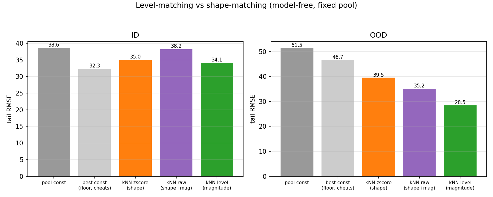

# Level-matching vs shape-matching in the model-free baselines

Two follow-up analyses on the baselines, prompted by the questions *“is `pool_tail_mean` the optimal constant?”* and *“should kNN-copy keep magnitude instead of z-scoring the match?”*. Numbers are regenerated by `benchmarking/few_shot/analyze_level_matching.py` (deterministic, model-free; `save=False`).

## 1. The constant floor — `pool_tail_mean` is not optimal, but no constant can be good

`pool_tail_mean` predicts the single constant **94.3** (the pool's average saturation level) for every test trace. Two questions: is that the best constant, and how good can any constant be?

| split | test levels span | best constant `c*` | RMSE of `c*` (floor) | `pool_tail_mean` RMSE | gap |
|---|---|---|---|---|---|
| ID | 70 … 146 | 115.5 | 32.31 | 38.65 | +6.34 |
| OOD | 66 … 184 | 116.0 | 46.75 | 51.54 | +4.79 |

- **A better constant exists** (gains 6.3 ID): `pool_tail_mean`'s 94 is biased low — the test traces saturate around 115. But the RMSE-minimizing constant is the **mean of the test levels** — you can only pick it by reading the test labels.
- **The real ceiling is the floor itself.** The optimal constant's RMSE is just the standard *deviation* of the test levels — and the traces span a wide range, so no single number fits them. To beat the floor you **must adapt per-trace**. That floor is the entire motivation for retrieval / ICL / finetuning.

## 2. kNN-copy: match by shape, magnitude, or level?

kNN-copy (k=5) retrieves the nearest pool traces and copies the mean of their tail levels. The neighbour **distance** decides what counts as “near”:

| distance | what it matches | ID | OOD |
|---|---|---|---|
| `zscore` (shipped) | z-scored context — **shape** | 34.98 | 39.54 |
| `raw` | raw context — shape + magnitude | 38.21 | 35.19 |
| `level` | `\|mean(ctx)−mean(q)\|` — **level** | **34.15** | **28.46** |

- **ID: level vs shape** Δ=-0.84 (level 34.15 vs zscore 34.98), 95% CI [-21.51, 15.11], p_boot=0.985, p_wilcoxon=0.688
- **OOD: level vs shape** Δ=-11.08 (level 28.46 vs zscore 39.54), 95% CI [-37.90, 10.16], p_boot=0.368, p_wilcoxon=0.438

**Takeaway.** z-scoring the match discards exactly the absolute level the metric scores, so shape-matching leaves OOD on the table. Matching on the **level alone** is best on both splits (and much better OOD). Notably `raw` (keeping shape *and* magnitude) is **not** the win — raw Euclidean is dominated by the high-variance early-growth shape, which dilutes the level signal; the clean move is *use magnitude, drop shape*. This is the model-free confirmation of the Phase-7 mechanism result that the raw context mean is the single strongest context-side predictor of the saturation level (ρ ≈ +0.89), and it motivates the `ctx_level` retrieval strategy (`selection.py`).

## 3. In the real ICL pipeline (Chronos-Bolt, shared scaling + mean)

`ctx_level` retrieval vs the shape-matching retrievers, run through the actual Bolt ICL pipeline (the model-free finding, with a model in the loop):

| strategy | k=5 (ID / OOD) | k=10 (ID / OOD) |
|---|---|---|
| random | 40.96 / 45.68 | 45.49 / 48.89 |
| ctx_euclid | 32.96 / 41.98 | 30.22 / 41.95 |
| ctx_level | 38.69 / 21.91 | 37.49 / 24.60 |
| mmr_euclid | 25.86 / 38.05 | 22.63 / 38.68 |

The pipeline numbers carry the usual n=6/5 caveat, but the level-vs-shape direction is consistent with the model-free comparison above.

## Where this is wired in

- `baselines.make_knn_copy_forecast(..., distance="zscore"|"raw"|"level")` — the distance knob (default `zscore` preserves the original baseline).
- `selection.py` `ctx_level` strategy (in `STRATEGIES`) — level-matching retrieval usable by any ICL grid.
- Regenerate: `python -m fusiontimeseries.benchmarking.few_shot.analyze_level_matching`.
- Mechanism context: [`mechanism_table.md`](mechanism_table.md) (the ρ ≈ +0.89 feature) and [`few_shot_icl.md`](../../methods/few_shot_icl.md).
