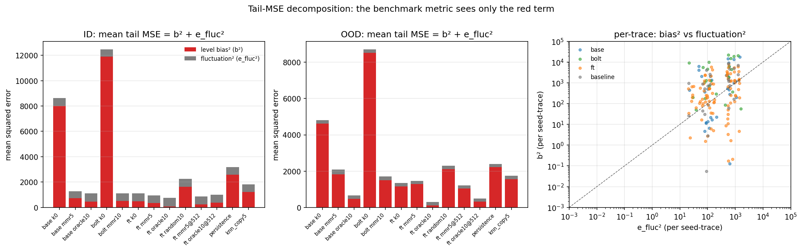
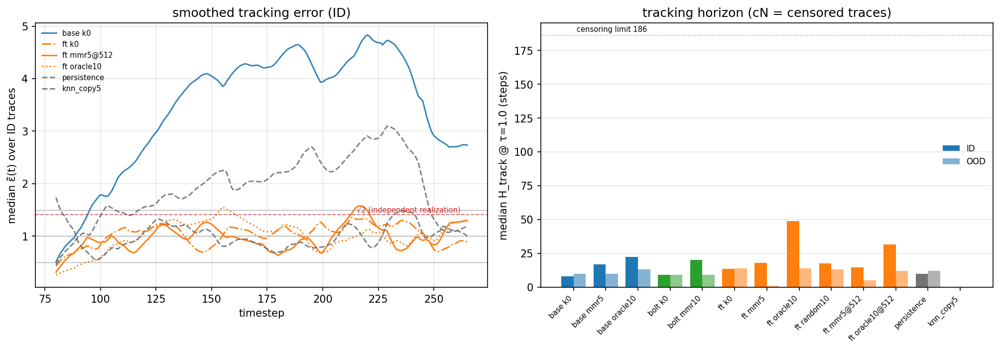
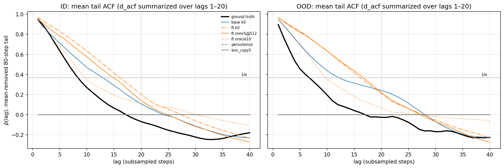
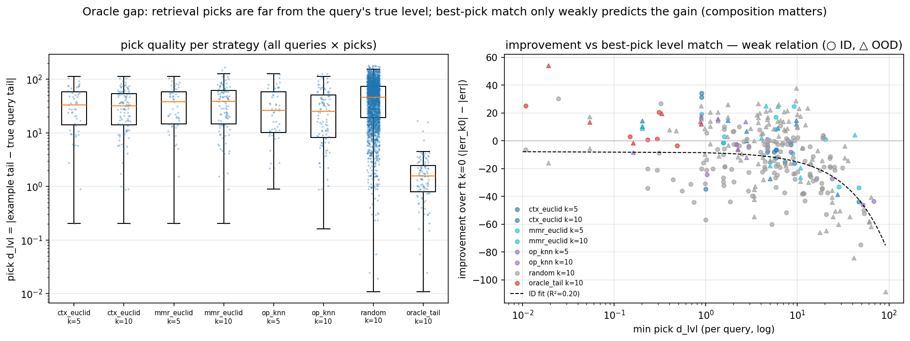

# Mechanism analysis — Phase 7 (where do the gains come from?)

Phases 2–6 measured THAT retrieval-ICL and finetuning help; this analysis explains WHY. Data: full-forecast dumps of 13 headline cells (`results/few_shot_v7_mechanism/`, re-run through the frozen harness with a forecast-capture hook — shared scaling + mean decoding throughout) whose per-trace tails reproduced the recorded v5/v6 scalars bit-exactly (143/143 reference comparisons bit-equal at dump time; re-asserted from the stored JSONs at every analyzer load), plus the Phase-6 scalar grid for the oracle-gap block (no model runs there). Framing: the context-parroting literature ([2505.11349](https://arxiv.org/abs/2505.11349), [2409.15771](https://arxiv.org/abs/2409.15771)) — TSFMs forecast chaotic systems by copying context motifs, fail pointwise quickly, yet preserve invariant statistics; our benchmark metric (tail-mean RMSE) is exactly such an invariant statistic.

## 1. Error decomposition — level bias vs fluctuation error

Per (seed, trace), the pointwise tail MSE over the last 80 steps splits EXACTLY into squared level bias and squared fluctuation error: `mean((ŷ−y)²) = b² + e_fluc²` with `b = mean(ŷ)−mean(y)` (identical to the result JSONs' `error`, asserted at load) and `e_fluc = RMSE((ŷ−m̂)−(y−ȳ))`. NOTE: `rmse_pt` below is this pointwise tail RMSE, NOT the benchmark's tail-MEAN RMSE — the benchmark metric sees only `b`. The chaos floor `σ_y·√2` is the expected `e_fluc` of an independent realization with the same statistics (two uncorrelated mean-zero series); `e_fluc/floor ≈ 1` means the forecast fluctuates like an independent sample (no phase tracking), `1/√2 ≈ 0.71` is an exact flatline, `> 1` means excess fluctuation. `r_σ = std(ŷ)/std(y)` checks invariant amplitude.

| config | split | n | rmse_pt | mean b² | mean e_fluc² | level share | r_σ | e_fluc/floor |
|---|---|---|---|---|---|---|---|---|
| base k0 | ID | 6 | 92.86 | 8012.0 | 610.8 | 0.93 | 0.16 | 0.72 |
| base k0 | OOD | 5 | 69.35 | 4615.4 | 194.4 | 0.96 | 0.60 | 0.75 |
| base mmr5 | ID | 6 | 35.84 | 732.3 | 552.1 | 0.57 | 0.40 | 0.69 |
| base mmr5 | OOD | 5 | 45.77 | 1817.8 | 277.0 | 0.87 | 0.47 | 0.89 |
| base oracle10 | ID | 6 | 33.24 | 467.2 | 637.8 | 0.42 | 0.09 | 0.74 |
| base oracle10 | OOD | 5 | 25.60 | 476.7 | 178.8 | 0.73 | 0.55 | 0.72 |
| bolt k0 | ID | 6 | 111.73 | 11887.6 | 595.3 | 0.95 | 0.04 | 0.71 |
| bolt k0 | OOD | 5 | 93.37 | 8523.2 | 195.7 | 0.98 | 0.37 | 0.75 |
| bolt mmr10 | ID | 6 | 33.28 | 512.2 | 595.0 | 0.46 | 0.25 | 0.71 |
| bolt mmr10 | OOD | 5 | 41.29 | 1496.2 | 208.5 | 0.88 | 0.24 | 0.77 |
| ft k0 | ID | 6 | 33.37 | 492.9 | 621.0 | 0.44 | 0.14 | 0.73 |
| ft k0 | OOD | 5 | 36.61 | 1162.9 | 177.7 | 0.87 | 0.39 | 0.71 |
| ft mmr5 | ID | 6 | 30.76 | 346.5 | 599.8 | 0.37 | 0.09 | 0.72 |
| ft mmr5 | OOD | 5 | 38.29 | 1295.8 | 170.2 | 0.88 | 0.25 | 0.70 |
| ft oracle10 | ID | 6 | 27.41 | 88.1 | 663.0 | 0.12 | 0.23 | 0.75 |
| ft oracle10 | OOD | 5 | 17.40 | 118.5 | 184.4 | 0.39 | 0.41 | 0.73 |
| ft random10 | ID | 18 | 47.36 | 1629.6 | 613.0 | 0.73 | 0.13 | 0.73 |
| ft random10 | OOD | 15 | 47.90 | 2114.2 | 179.8 | 0.92 | 0.25 | 0.72 |
| ft mmr5@512 | ID | 6 | 29.55 | 244.3 | 628.6 | 0.28 | 0.14 | 0.73 |
| ft mmr5@512 | OOD | 5 | 34.92 | 1045.7 | 173.8 | 0.86 | 0.35 | 0.71 |
| ft oracle10@512 | ID | 6 | 31.78 | 382.8 | 627.4 | 0.38 | 0.15 | 0.73 |
| ft oracle10@512 | OOD | 5 | 22.03 | 324.0 | 161.4 | 0.67 | 0.32 | 0.68 |
| persistence | ID | 6 | 56.35 | 2592.3 | 583.1 | 0.82 | 0.00 | 0.71 |
| persistence | OOD | 5 | 48.89 | 2215.5 | 174.7 | 0.93 | 0.00 | 0.71 |
| knn_copy5 | ID | 6 | 42.51 | 1223.9 | 583.1 | 0.68 | 0.00 | 0.71 |
| knn_copy5 | OOD | 5 | 41.69 | 1563.6 | 174.7 | 0.90 | 0.00 | 0.71 |

Claim test — per config vs its k=0 anchor, how much of the tail-MSE improvement is absorbed by the LEVEL term (Δb²/ΔMSE; ≈1 ⇒ the gain is pure level calibration):

| config | anchor | split | ΔMSE (anchor−config) | Δb² | Δe_fluc² | level absorbed |
|---|---|---|---|---|---|---|
| base mmr5 | base k0 | ID | +7338.4 | +7279.7 | +58.7 | 0.99 |
| base mmr5 | base k0 | OOD | +2715.0 | +2797.7 | -82.7 | 1.03 |
| base oracle10 | base k0 | ID | +7517.8 | +7544.9 | -27.0 | 1.00 |
| base oracle10 | base k0 | OOD | +4154.3 | +4138.7 | +15.6 | 1.00 |
| bolt mmr10 | bolt k0 | ID | +11375.7 | +11375.4 | +0.3 | 1.00 |
| bolt mmr10 | bolt k0 | OOD | +7014.2 | +7027.0 | -12.8 | 1.00 |
| ft mmr5 | ft k0 | ID | +167.5 | +146.4 | +21.1 | 0.87 |
| ft mmr5 | ft k0 | OOD | -125.4 | -132.9 | +7.5 | 1.06 |
| ft oracle10 | ft k0 | ID | +362.8 | +404.9 | -42.1 | 1.12 |
| ft oracle10 | ft k0 | OOD | +1037.7 | +1044.4 | -6.7 | 1.01 |
| ft random10 | ft k0 | ID | -1128.7 | -1136.6 | +8.0 | 1.01 |
| ft random10 | ft k0 | OOD | -953.5 | -951.3 | -2.2 | 1.00 |
| ft mmr5@512 | ft k0 | ID | +240.9 | +248.6 | -7.7 | 1.03 |
| ft mmr5@512 | ft k0 | OOD | +121.1 | +117.2 | +3.9 | 0.97 |
| ft oracle10@512 | ft k0 | ID | +103.7 | +110.1 | -6.5 | 1.06 |
| ft oracle10@512 | ft k0 | OOD | +855.2 | +838.9 | +16.3 | 0.98 |

## 2. Rollout stability — tracking horizon and invariant statistics

Does ICL/finetuning extend the usable autoregressive horizon? `ε(t) = |ŷ(t)−y(t)|/σ_y` (σ_y = truth tail std), smoothed with a centered L=16 moving mean; `H_track` = first forecast step where ε̃ > τ. Right-censored at 186 steps (counts reported); onsets are quantized by the 64-step rollout chunks. Sliding-window Pearson was rejected: on saturated turbulence even a perfect-statistics forecast decorrelates (r≈0), so correlation measures phase luck, not usefulness. CAVEAT — on a chaotic saturated series, ε̃ of a perfect-statistics forecast hovers near √2 ≈ 1.41, so τ=1.0 horizons are short for EVERY method by construction; the invariant-statistics block below is the primary stability evidence. The GyroSwin paper's ~110-step correlation time (vs ~7–10 for baselines) is on 5D states with a different metric — the comparison is QUALITATIVE only (our traces are additionally 1/3-subsampled).

| config | split | H@τ=0.5 | H@τ=1.0 | H@τ=1.5 | censored@1.0 | n |
|---|---|---|---|---|---|---|
| base k0 | ID | 1 | 8 | 16 | 0/6 | 6 |
| base k0 | OOD | 6 | 10 | 30 | 0/5 | 5 |
| base mmr5 | ID | 8 | 17 | 51 | 0/6 | 6 |
| base mmr5 | OOD | 2 | 10 | 14 | 0/5 | 5 |
| base oracle10 | ID | 10 | 22 | 53 | 0/6 | 6 |
| base oracle10 | OOD | 0 | 13 | 51 | 0/5 | 5 |
| bolt k0 | ID | 1 | 9 | 19 | 0/6 | 6 |
| bolt k0 | OOD | 5 | 9 | 17 | 0/5 | 5 |
| bolt mmr10 | ID | 6 | 20 | 30 | 0/6 | 6 |
| bolt mmr10 | OOD | 0 | 9 | 14 | 0/5 | 5 |
| ft k0 | ID | 8 | 14 | 46 | 0/6 | 6 |
| ft k0 | OOD | 0 | 14 | 56 | 0/5 | 5 |
| ft mmr5 | ID | 9 | 18 | 91 | 0/6 | 6 |
| ft mmr5 | OOD | 0 | 1 | 10 | 0/5 | 5 |
| ft oracle10 | ID | 12 | 49 | 60 | 0/6 | 6 |
| ft oracle10 | OOD | 0 | 14 | 36 | 0/5 | 5 |
| ft random10 | ID | 11 | 18 | 36 | 0/18 | 18 |
| ft random10 | OOD | 0 | 13 | 15 | 0/15 | 15 |
| ft mmr5@512 | ID | 7 | 14 | 22 | 0/6 | 6 |
| ft mmr5@512 | OOD | 0 | 5 | 54 | 0/5 | 5 |
| ft oracle10@512 | ID | 12 | 32 | 54 | 0/6 | 6 |
| ft oracle10@512 | OOD | 0 | 12 | 23 | 0/5 | 5 |
| persistence | ID | 4 | 10 | 24 | 0/6 | 6 |
| persistence | OOD | 9 | 12 | 15 | 0/5 | 5 |
| knn_copy5 | ID | 0 | 0 | 0 | 0/6 | 6 |
| knn_copy5 | OOD | 0 | 0 | 0 | 0/5 | 5 |

Invariant statistics on the mean-removed 80-step tail (the context-parroting literature's claim: TSFMs preserve invariant statistics after point tracking fails): `d_acf` = mean abs ACF distance to the truth over lags 1–20 (biased estimator; lags beyond are figure-only — too noisy at n=80), `τ_c` = first lag with ρ̂ < 1/e, flatline = share of forecasts with `r_σ < 0.2` (the crispest stability statistic: a flatlined rollout has no fluctuation structure at all).

| config | split | d_acf (1–20) | median τ_c (truth: ID 9 / OOD 8) | flatlines |
|---|---|---|---|---|
| base k0 | ID | 0.220 | 17 | 4/6 |
| base k0 | OOD | 0.240 | 16 | 2/5 |
| base mmr5 | ID | 0.237 | 12 | 3/6 |
| base mmr5 | OOD | 0.239 | 7 | 2/5 |
| base oracle10 | ID | 0.253 | 12 | 5/6 |
| base oracle10 | OOD | 0.242 | 10 | 3/5 |
| bolt k0 | ID | 0.341 | 4 | 6/6 |
| bolt k0 | OOD | 0.386 | 5 | 3/5 |
| bolt mmr10 | ID | 0.236 | 14 | 3/6 |
| bolt mmr10 | OOD | 0.272 | 10 | 4/5 |
| ft k0 | ID | 0.272 | 16 | 5/6 |
| ft k0 | OOD | 0.343 | 16 | 1/5 |
| ft mmr5 | ID | 0.234 | 16 | 6/6 |
| ft mmr5 | OOD | 0.302 | 16 | 2/5 |
| ft oracle10 | ID | 0.151 | 10 | 3/6 |
| ft oracle10 | OOD | 0.211 | 10 | 1/5 |
| ft random10 | ID | 0.202 | 12 | 15/18 |
| ft random10 | OOD | 0.267 | 14 | 7/15 |
| ft mmr5@512 | ID | 0.235 | 16 | 5/6 |
| ft mmr5@512 | OOD | 0.347 | 17 | 1/5 |
| ft oracle10@512 | ID | 0.273 | 16 | 4/6 |
| ft oracle10@512 | OOD | 0.350 | 17 | 2/5 |
| persistence | ID | 0.384 | 1 | 6/6 |
| persistence | OOD | 0.326 | 1 | 5/5 |
| knn_copy5 | ID | 0.384 | 1 | 6/6 |
| knn_copy5 | OOD | 0.326 | 1 | 5/5 |

## 3. The oracle–legit gap — the pool has the right examples, retrieval can't see them

All from v6 `example_ids` + the 245-trace pool (no model runs); errors are the ft-model mean-decoding cells, improvement is vs the ft k=0 anchor. `d_lvl` = |example tail mean − TRUE query tail mean| — what the oracle minimizes and what the metric ultimately scores.

Pick quality per strategy (over all queries × picks; seeds for random):

| strategy | k | median pick d_lvl | median per-query min d_lvl | median improvement (ID) |
|---|---|---|---|---|
| ctx_euclid | 5 | 33.55 | 7.19 | -9.46 |
| ctx_euclid | 10 | 31.83 | 5.69 | -7.43 |
| mmr_euclid | 5 | 38.32 | 9.01 | -0.17 |
| mmr_euclid | 10 | 38.65 | 3.13 | +0.92 |
| op_knn | 5 | 26.15 | 8.15 | -5.29 |
| op_knn | 10 | 25.52 | 3.82 | -5.64 |
| random | 10 | 45.95 | 5.82 | -18.83 |
| oracle_tail (cheats) | 10 | 1.56 | 0.26 | +2.27 |

Note: median per-trace improvement understates the RMSE story — the headline RMSE gains come from fixing the LARGEST-level traces (see the per-trace table below), not the median trace.

Why context distance cannot find the oracle's picks — the oracle's k=10 picks ranked by context/param distance (median rank of 245; ~122 would be chance), and pool-wide Spearman between each distance and `d_lvl` per query:

| query | split | pool-min d_lvl | oracle picks' median ctx-rank | median op-rank | ρ(d_ctx, d_lvl) | ρ(d_op, d_lvl) |
|---|---|---|---|---|---|---|
| it_8 | ID | 0.01 | 192 | 88 | +0.23 | +0.22 |
| it_115 | ID | 0.15 | 98 | 82 | +0.37 | +0.58 |
| it_131 | ID | 0.23 | 128 | 23 | -0.07 | +0.49 |
| it_148 | ID | 0.49 | 48 | 18 | +0.41 | +0.45 |
| it_235 | ID | 0.30 | 49 | 52 | +0.50 | +0.63 |
| it_262 | ID | 0.31 | 162 | 98 | +0.36 | +0.45 |
| ood_it_0 | OOD | 0.05 | 124 | 40 | +0.23 | +0.50 |
| ood_it_1 | OOD | 0.33 | 96 | 88 | +0.20 | +0.38 |
| ood_it_2 | OOD | 0.89 | 108 | 34 | +0.24 | +0.58 |
| ood_it_3 | OOD | 0.16 | 95 | 30 | +0.62 | +0.85 |
| ood_it_4 | OOD | 0.02 | 87 | 156 | +0.25 | +0.14 |
| **median** | | 0.23 | 98 | 52 | +0.25 | +0.49 |

Context-side feature hunt — pool-wide Spearman between cheap context features and the example's OWN tail level (a feature that sees the level from 80 linear-phase steps would make a training-free level-matching selector possible):

| feature | ρ(feature, tail mean) over the pool |
|---|---|
| ctx_mean | +0.892 ← best |
| last16_mean | +0.847 |
| ctx_max | +0.859 |
| growth_rate | -0.466 |
| ctx_std | +0.835 |

OFFLINE feature-knn simulation (selection only, k=5, best feature = `ctx_mean`): median per-query min d_lvl 4.96 ID (6.70 all). EXTRAPOLATION (labeled as such — no model run): the ID cloud's linear fit improvement ≈ -7.8 + -0.74·min_d_lvl (R²=0.20, Spearman ρ=-0.31) predicts a feature-knn ID RMSE of ≈ 46.1. Read this as 'the cloud cannot promise a gain', not as a prediction: at R²=0.20 best-pick level match is NOT a sufficient statistic of the gain — context COMPOSITION (the wrong-level example mass the Phase-6 win512 clamp removes) carries the rest of the variance, so a level-aware selector would have to be paired with composition control (e.g. drop unmatched picks rather than fill k) before it could pay off.

## 4. Per-trace breakdown

Signed tail-mean errors (pred − true) of the three headline ft cells, against the best the pool could possibly offer (`pool-min d_lvl` — by construction the oracle's top pick, asserted):

| trace | true tail | ft k0 err | ft mmr5@512 err (best legit) | ft oracle10 err (cheats) | pool-min d_lvl |
|---|---|---|---|---|---|
| it_8 | 146.25 | -39.08 | +2.16 | -13.96 | 0.01 |
| it_115 | 74.92 | -11.16 | -8.94 | +8.03 | 0.15 |
| it_131 | 142.04 | -1.28 | -23.05 | +0.46 | 0.23 |
| it_148 | 70.38 | -2.45 | -22.76 | +5.88 | 0.49 |
| it_235 | 113.45 | -1.83 | +8.86 | -0.41 | 0.30 |
| it_262 | 145.95 | -35.99 | +15.93 | -15.31 | 0.31 |
| ood_it_0 | 65.96 | +22.96 | +23.11 | +9.47 | 0.05 |
| ood_it_1 | 72.22 | +30.51 | +48.70 | +11.02 | 0.33 |
| ood_it_2 | 101.17 | +26.29 | +11.51 | +14.15 | 0.89 |
| ood_it_3 | 184.33 | +10.78 | -2.23 | -12.29 | 0.16 |
| ood_it_4 | 156.23 | -59.58 | -46.75 | -5.48 | 0.02 |

## 5. Forecast grids

Truth + forecast overlays for the 7 headline configs (seed 42, vertical line = forecast start):

- `forecast_grid_base_k0_id.png`
- `forecast_grid_base_k0_ood.png`
- `forecast_grid_ft_k0_id.png`
- `forecast_grid_ft_k0_ood.png`
- `forecast_grid_ft_mmr5_id.png`
- `forecast_grid_ft_mmr5_ood.png`
- `forecast_grid_ft_mmr5_win512_id.png`
- `forecast_grid_ft_mmr5_win512_ood.png`
- `forecast_grid_ft_oracle10_id.png`
- `forecast_grid_ft_oracle10_ood.png`
- `forecast_grid_ft_oracle10_win512_id.png`
- `forecast_grid_ft_oracle10_win512_ood.png`
- `forecast_grid_persistence_id.png`
- `forecast_grid_persistence_ood.png`

## Verdict

**Verdict — the gains are level calibration; nothing tracks the turbulence,
and the oracle gap is an information limit of the 80-step context, not a
distance-function deficiency.**

(1) **Decomposition: adaptation buys level, nothing else.** In all 16
claim-test rows the level term absorbs 87–112% of the tail-MSE change
(Δb²/ΔMSE ≈ 1 up to per-trace noise) — retrieval-ICL, finetuning, the
window clamp, and even the HARM from random examples are all movements of
the predicted saturation level; the fluctuation error never moves. e_fluc
sits at 0.68–0.89× the chaos floor σ_y·√2 in every one of the 26
config×split rows (an exact flatline gives 0.71): no configuration
phase-tracks the turbulence — exactly the context-parroting prediction.
Since the benchmark metric reads only the level term (√(mean b²) ≡ the
benchmark tail RMSE; ft k0: √492.9 = 22.2), "better RMSE" and "better level
calibration" are the same statement — this is WHY shared scaling (Phase 3)
was the unlock and WHY retrieval works at all. After finetuning, the ID
level share drops to 0.44 (k0) and 0.12 (oracle ICL): on ID the level
problem is largely solved and the residual is irreducible fluctuation. OOD
level share stays ≥ 0.67 for every legit config — OOD remains an unsolved
level problem (only the cheating oracle pushes it to 0.39).

(2) **Rollout stability: no genuine horizon extension; under-dispersion is
universal.** Median tracking horizons at τ=1.0 are 8–22 steps for nearly
every config — the truth's own correlation time is 8–9 steps, so phase
tracking cannot survive much past ~10 steps on a chaotic series (GyroSwin's
~110 vs 7–10 is a different metric on 5D states; qualitative context only).
The one apparent extension — ft oracle10 at 49 ID — is itself a level
effect: an under-dispersed forecast (r_σ ≈ 0.2) at the RIGHT level keeps
ε̃ ≈ 0.8 < τ without tracking anything. The invariant statistics show every
TSFM rollout under-disperses (r_σ ≤ 0.6 in all 26 rows; the r_σ<0.2
flatline fraction is 3/6–6/6 on ID even for the finetuned model; the
baselines are exact flatlines, τ_c = 1) and over-smooths (forecast τ_c
typically 12–17 vs truth 8–9). Example QUALITY, not finetuning, governs
what little structure survives: the oracle-fed ft model has the fewest
flatlines (3/6 ID, 1/5 OOD), the truth-closest ACF (d_acf 0.151), and a
truth-like τ_c (10) — copying the right level apparently comes with copying
truth-like fluctuation statistics.

(3) **Oracle gap: the pool always contains a near-twin; no function of the
80-step context can find it.** Pool-min d_lvl ≤ 0.9 for all 11 queries
(median 0.23) — label-aware selection has huge headroom, as the oracle
cells prove. But the oracle's picks sit at median ctx-rank 98/245 (chance
≈ 122) and pool-wide ρ(d_ctx, d_lvl) is only +0.25 — BY CONSTRUCTION:
every Phase-2 retrieval distance z-scores the context, erasing exactly the
level information the metric scores. Operating parameters do carry level
information (ρ(d_op, d_lvl) = +0.49, oracle op-rank 52/245), yet op_knn
scores ≈ random even on the param-CONDITIONED ft model (39.6 vs 40.0 ID;
the Phase-7 probe): partial level correlation does not put level-matched
examples into the top-k. The strongest context-side level signal is the
raw context MEAN (pool-wide ρ(ctx_mean, own tail) = +0.89 — the same
signal kNN-copy and shared scaling already exploit), but even a
ctx_mean-knn selector only reaches min d_lvl ≈ 5 ID (mmr k10: 3.1; oracle:
0.26) — an order of magnitude short. And best-pick level match alone is
NOT a sufficient statistic of the gain: the improvement-vs-min-d_lvl cloud
is only weakly monotone (Spearman −0.31, R² 0.20); context COMPOSITION —
the wrong-level example mass the Phase-6 win512 clamp removes — carries
the rest of the variance, which is why the labeled feature-knn
extrapolation promises no gain. The 80-step linear-phase context
under-determines the saturation level by ~5 flux units; closing the
oracle gap needs side information (a trained level predictor, more
physics, labels), not a better distance over the same 80 steps.

(4) **Per-trace: retrieval's RMSE gain is concentrated in the
highest-level traces.** ft k0's two big ID misses are the two ~146-level
traces (it_8 −39.1, it_262 −36.0); best-legit retrieval fixes exactly
those (+2.2, +15.9) while paying smaller new errors elsewhere (it_131
−1.3 → −23.1) — hence median per-trace improvement ≈ 0 while RMSE improves
22.2 → 15.6. OOD errors are systematic over-predictions on 4/5 traces that
legit retrieval barely moves (and ood_it_4's −59.6 under-prediction needs
the oracle to fix) — consistent with Phase 6's "OOD is finetuning's story
alone".
