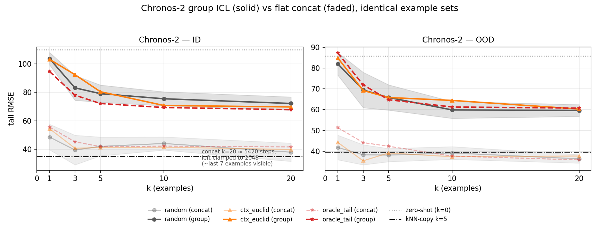

# Few-shot example presentation — Phase 3 results

Protocol: fixed 245-trace pool, full-length example targets (t266), context 80, prediction 64, tail 80; same harness and metric as Phase 2. Cells are `ID / OOD` tail RMSE; multi-seed cells are mean±std over selection seeds (random: 20, shuffled order: 5), deterministic cells a single pass (seed 42). All cells come from ONE grid run (`results/few_shot_v3_presentation/`).

Model-free reference — kNN-copy k=5 (absolute level copy, rescale=False): **34.98 ID / 39.54 OOD**.

## A — Chronos-2: group ICL vs flat concat

Examples as group rows (`past_covariates` of one dict task, GroupSelfAttention) vs the Phase-1/2 spliced concatenation — identical example sets per cell pair (hard-asserted). Note concat at k=20 is ~5420 steps, left-clamped to Chronos-2's 2048-step context (≈ last 7 examples visible).

Zero-shot anchor (k=0): 109.91 ID / 85.86 OOD (identical for both presentations)

| variant | k=1 | k=3 | k=5 | k=10 | k=20 |
|---|---|---|---|---|---|
| random (concat) | 48.67±8.97 / 41.81±5.91 | 39.54±10.38 / 38.30±4.84 | 42.07±6.59 / 38.14±3.17 | 44.12±4.62 / 39.16±3.07 | 38.01±6.42 / 36.33±2.04 |
| random (group) | 103.60±4.39 / 82.05±5.48 | 83.14±8.71 / 69.47±8.52 | 79.07±6.05 / 65.87±6.08 | 75.49±4.90 / 59.87±4.06 | 72.20±4.57 / 59.61±2.85 |
| ctx_euclid (concat) | 54.47 / 44.24 | 40.75 / 35.39 | 41.27 / 39.16 | 41.53 / 37.35 | 39.90 / 37.68 |
| ctx_euclid (group) | 103.13 / 84.89 | 92.39 / 69.22 | 80.43 / 65.83 | 70.78 / 64.44 | 69.75 / 60.30 |
| oracle_tail (concat) | 55.61 / 51.36 | 45.28 / 44.15 | 41.91 / 42.37 | 42.26 / 37.66 | 41.73 / 35.83 |
| oracle_tail (group) | 94.60 / 87.30 | 78.00 / 71.91 | 72.16 / 64.77 | 69.35 / 61.28 | 67.83 / 60.74 |

## B — Normalization: per-example vs shared scaling

`shared` = ONE scaler fit on the query context applied to examples and query (absolute level survives); `per-example` = the Phase-1/2 default (level erased). Full strategy grid under shared; per-example anchors for random / ctx_euclid / oracle_tail.

### NX-AI/TiRex

Zero-shot anchor (k=0): 78.92 ID / 62.49 OOD

| variant | k=1 | k=3 | k=5 | k=10 | k=20 |
|---|---|---|---|---|---|
| random (per-example) | 44.84±7.75 / 40.68±3.46 | 37.83±8.89 / 38.07±3.69 | 35.95±6.94 / 36.05±2.24 | 38.97±7.31 / 37.07±3.75 | — |
| random (shared) | 49.83±21.84 / 46.59±15.15 | 40.55±11.36 / 41.96±6.01 | 42.31±11.30 / 45.48±5.71 | 44.61±13.65 / 48.56±8.15 | 42.12±12.36 / 46.54±6.66 |
| op_knn (shared) | 49.03 / 35.66 | 45.27 / 35.95 | 44.38 / 35.36 | 44.27 / 33.43 | — |
| ctx_euclid (per-example) | 47.63 / 38.76 | 38.91 / 35.50 | 37.71 / 35.57 | 37.22 / 36.58 | — |
| ctx_euclid (shared) | 46.21 / 36.15 | 31.58 / 38.66 | 31.57 / 37.24 | 30.77 / 38.62 | 30.77 / 38.62 |
| ctx_dtw (shared) | 42.32 / 44.22 | 37.39 / 48.55 | 32.31 / 44.84 | 29.53 / 41.06 | — |
| ctx_growth (shared) | 61.84 / 47.84 | 50.06 / 42.16 | 49.61 / 38.66 | 48.95 / 40.93 | — |
| mmr_euclid (shared) | 46.21 / 36.15 | 34.77 / 33.09 | 35.51 / 32.38 | 32.82 / 35.28 | — |
| oracle_tail (per-example) | 50.60 / 42.79 | 42.87 / 37.70 | 42.49 / 37.25 | 43.12 / 35.92 | — |
| oracle_tail (shared) | 45.99 / 29.37 | 36.26 / 20.89 | 32.70 / 23.32 | 30.65 / 18.01 | — |

### amazon/chronos-2

Zero-shot anchor (k=0): 109.91 ID / 85.86 OOD

| variant | k=1 | k=3 | k=5 | k=10 |
|---|---|---|---|---|
| random (per-example) | 48.67±8.97 / 41.81±5.91 | 39.54±10.38 / 38.30±4.84 | 42.07±6.59 / 38.14±3.17 | 44.12±4.62 / 39.16±3.07 |
| random (shared) | 51.69±23.23 / 52.38±14.52 | 48.36±10.71 / 51.33±8.99 | 46.73±8.05 / 51.71±6.30 | 44.42±8.36 / 49.18±6.63 |
| op_knn (shared) | 49.55 / 42.17 | 46.29 / 41.00 | 47.35 / 35.82 | 47.67 / 38.89 |
| ctx_euclid (per-example) | 54.47 / 44.24 | 40.75 / 35.39 | 41.27 / 39.16 | 41.53 / 37.35 |
| ctx_euclid (shared) | 49.71 / 39.43 | 35.31 / 25.35 | 37.99 / 34.25 | 33.91 / 33.52 |
| ctx_dtw (shared) | 48.34 / 49.43 | 43.48 / 42.44 | 36.95 / 40.20 | 38.05 / 40.52 |
| ctx_growth (shared) | 69.97 / 61.36 | 53.88 / 47.95 | 42.53 / 45.20 | 47.17 / 47.02 |
| mmr_euclid (shared) | 49.71 / 39.43 | 37.66 / 42.18 | 29.40 / 42.56 | 37.32 / 45.11 |
| oracle_tail (per-example) | 55.61 / 51.36 | 45.28 / 44.15 | 41.91 / 42.37 | 42.26 / 37.66 |
| oracle_tail (shared) | 38.41 / 46.04 | 27.60 / 38.57 | 23.53 / 37.52 | 23.31 / 23.99 |

### amazon/chronos-bolt-tiny

Zero-shot anchor (k=0): 111.65 ID / 90.69 OOD

| variant | k=1 | k=3 | k=5 | k=10 |
|---|---|---|---|---|
| random (per-example) | 40.20±10.31 / 44.26±10.36 | 31.85±9.85 / 38.00±4.59 | 34.15±7.97 / 36.28±2.70 | 32.02±11.06 / 37.70±4.02 |
| random (shared) | 47.38±19.08 / 53.43±12.36 | 40.40±9.28 / 44.44±4.66 | 41.10±8.74 / 44.95±5.35 | 38.84±12.97 / 45.16±5.41 |
| op_knn (shared) | 48.21 / 47.76 | 38.16 / 40.65 | 38.54 / 37.69 | 37.90 / 36.18 |
| ctx_euclid (per-example) | 47.49 / 44.69 | 35.67 / 35.89 | 36.16 / 36.07 | 35.43 / 36.04 |
| ctx_euclid (shared) | 55.51 / 43.10 | 33.62 / 33.35 | 32.42 / 40.55 | 29.70 / 41.21 |
| ctx_dtw (shared) | 36.73 / 63.56 | 31.23 / 66.67 | 31.26 / 55.30 | 29.13 / 45.88 |
| ctx_growth (shared) | 57.80 / 43.85 | 45.34 / 48.46 | 44.48 / 45.05 | 44.86 / 45.69 |
| mmr_euclid (shared) | 55.51 / 43.10 | 29.37 / 36.91 | 26.35 / 37.20 | 23.28 / 37.81 |
| oracle_tail (per-example) | 28.76 / 38.55 | 32.13 / 37.95 | 33.24 / 36.04 | 32.01 / 35.33 |
| oracle_tail (shared) | 36.29 / 20.58 | 33.11 / 10.02 | 29.02 / 10.49 | 26.01 / 9.81 |

### google/timesfm-2.5-200m-pytorch

Zero-shot anchor (k=0): 97.54 ID / 87.70 OOD

| variant | k=1 | k=3 | k=5 | k=10 | k=20 |
|---|---|---|---|---|---|
| random (per-example) | 53.08±10.93 / 47.44±10.14 | 39.63±10.67 / 37.87±4.79 | 41.41±8.26 / 38.02±4.18 | 40.82±9.12 / 38.10±4.87 | — |
| random (shared) | 50.57±15.70 / 58.50±13.78 | 45.22±12.18 / 52.85±8.24 | 43.51±8.77 / 52.24±6.74 | 45.73±11.35 / 53.24±8.31 | 38.45±8.71 / 47.42±5.97 |
| op_knn (shared) | 54.95 / 54.09 | 43.76 / 36.39 | 43.80 / 33.96 | 43.67 / 32.11 | — |
| ctx_euclid (per-example) | 43.92 / 43.64 | 39.48 / 37.02 | 38.89 / 36.07 | 39.00 / 37.58 | — |
| ctx_euclid (shared) | 38.20 / 37.64 | 36.94 / 47.79 | 30.47 / 46.22 | 33.94 / 49.68 | 33.94 / 49.68 |
| ctx_dtw (shared) | 39.49 / 48.98 | 31.47 / 45.13 | 30.52 / 42.41 | 29.28 / 40.74 | — |
| ctx_growth (shared) | 66.99 / 82.23 | 46.60 / 39.68 | 47.19 / 44.24 | 38.62 / 43.64 | — |
| mmr_euclid (shared) | 38.20 / 37.64 | 31.25 / 46.02 | 28.46 / 44.31 | 23.85 / 37.62 | — |
| oracle_tail (per-example) | 53.28 / 46.36 | 42.59 / 47.78 | 39.09 / 37.88 | 35.46 / 38.97 | — |
| oracle_tail (shared) | 44.04 / 31.47 | 29.33 / 16.54 | 20.03 / 14.48 | 15.99 / 8.10 | — |

## C — Ordering (ctx_euclid, per-example norm)

Phase-2 convention is most-similar LAST (adjacent to the query). `shuffled` permutes deterministically per (seed, query); k=1 is order-free.

### NX-AI/TiRex

| variant | k=3 | k=5 | k=10 |
|---|---|---|---|
| similar_last (anchor) | 38.91 / 35.50 | 37.71 / 35.57 | 37.22 / 36.58 |
| similar_first | 35.32 / 38.23 | 39.66 / 37.79 | 41.92 / 33.40 |
| shuffled | 36.89±1.02 / 36.64±1.18 | 37.88±1.83 / 36.48±3.24 | 38.30±1.02 / 34.61±3.09 |

### amazon/chronos-2

| variant | k=3 | k=5 | k=10 |
|---|---|---|---|
| similar_last (anchor) | 40.75 / 35.39 | 41.27 / 39.16 | 41.53 / 37.35 |
| similar_first | 37.04 / 39.71 | 41.37 / 34.95 | 42.68 / 32.62 |
| shuffled | 38.40±2.51 / 38.08±2.35 | 39.22±3.09 / 34.80±2.74 | 39.55±2.53 / 34.09±2.08 |

### amazon/chronos-bolt-tiny

| variant | k=3 | k=5 | k=10 |
|---|---|---|---|
| similar_last (anchor) | 35.67 / 35.89 | 36.16 / 36.07 | 35.43 / 36.04 |
| similar_first | 32.05 / 43.73 | 31.38 / 31.98 | 37.98 / 42.03 |
| shuffled | 35.38±1.45 / 40.58±4.83 | 33.45±4.10 / 35.89±2.84 | 34.75±5.89 / 34.37±2.71 |

### google/timesfm-2.5-200m-pytorch

| variant | k=3 | k=5 | k=10 |
|---|---|---|---|
| similar_last (anchor) | 39.48 / 37.02 | 38.89 / 36.07 | 39.00 / 37.58 |
| similar_first | 35.42 / 43.62 | 38.88 / 30.46 | 38.78 / 33.22 |
| shuffled | 37.32±1.71 / 38.92±2.33 | 38.86±1.93 / 34.19±3.70 | 38.01±1.98 / 34.07±2.10 |

## D — Truncated examples (peak+64, shared norm)

Truncation applied AFTER selection (rankings see full traces). Mean truncated length ≈ 130 vs full 267: k=10 fits TimesFM's 2048-step window (~1383 steps), k=20 (~2686) truncates again — k=20 cells still partially measure the window.

### NX-AI/TiRex

| variant | k=5 | k=10 | k=20 |
|---|---|---|---|
| random (full) | 42.31±11.30 / 45.48±5.71 | 44.61±13.65 / 48.56±8.15 | 42.12±12.36 / 46.54±6.66 |
| random (trunc64) | 64.67±7.42 / 56.36±6.46 | 62.10±12.47 / 58.42±8.94 | 61.16±8.24 / 58.58±8.04 |
| ctx_euclid (full) | 31.57 / 37.24 | 30.77 / 38.62 | 30.77 / 38.62 |
| ctx_euclid (trunc64) | 51.80 / 42.97 | 42.92 / 43.00 | 43.95 / 45.97 |

### google/timesfm-2.5-200m-pytorch

| variant | k=5 | k=10 | k=20 |
|---|---|---|---|
| random (full) | 43.51±8.77 / 52.24±6.74 | 45.73±11.35 / 53.24±8.31 | 38.45±8.71 / 47.42±5.97 |
| random (trunc64) | 68.60±17.92 / 73.62±16.54 | 61.72±11.77 / 67.36±12.76 | 60.06±12.52 / 67.42±11.69 |
| ctx_euclid (full) | 30.47 / 46.22 | 33.94 / 49.68 | 33.94 / 49.68 |
| ctx_euclid (trunc64) | 45.68 / 58.15 | 47.41 / 51.28 | 46.94 / 52.47 |

## Paired comparisons (pairing=trace, bootstrap CI primary)

Δ = RMSE(A) − RMSE(B); negative favours A. CI/p from a 10k paired bootstrap over traces; Wilcoxon shown for completeness (p floors 0.031 ID / 0.0625 OOD). `[trace_seed]` rows appear where seed sets are identical.

### A — group vs concat (amazon/chronos-2)

| A vs B | split | RMSE A | RMSE B | Δ(A−B) | 95% CI | p_boot | p_wilcoxon |
|---|---|---|---|---|---|---|---|
| random group(k=20) vs concat(k=20) | ID | 72.34 | 38.52 | +33.82 | [29.51, 38.98] | 0.000 | 0.031 |
| random group(k=20) vs concat(k=20) [trace_seed] | ID | 72.34 | 38.52 | +33.82 | [31.63, 36.12] | 0.000 | 0.000 |
| random group(k=20) vs concat(k=20) | OOD | 59.67 | 36.39 | +23.28 | [11.30, 36.73] | 0.000 | 0.062 |
| random group(k=20) vs concat(k=20) [trace_seed] | OOD | 59.67 | 36.39 | +23.28 | [20.59, 26.03] | 0.000 | 0.000 |
| ctx_euclid group(k=20) vs concat(k=20) | ID | 69.75 | 39.90 | +29.85 | [25.66, 34.91] | 0.000 | 0.031 |
| ctx_euclid group(k=20) vs concat(k=20) | OOD | 60.30 | 37.68 | +22.62 | [14.57, 33.84] | 0.000 | 0.062 |
| oracle_tail group(k=20) vs concat(k=20) | ID | 67.83 | 41.73 | +26.10 | [23.21, 29.50] | 0.000 | 0.031 |
| oracle_tail group(k=20) vs concat(k=20) | OOD | 60.74 | 35.83 | +24.91 | [9.16, 47.78] | 0.000 | 0.125 |

### B — normalization (NX-AI/TiRex)

| A vs B | split | RMSE A | RMSE B | Δ(A−B) | 95% CI | p_boot | p_wilcoxon |
|---|---|---|---|---|---|---|---|
| oracle__shared(k=10) vs oracle__base(k=5) | ID | 30.65 | 42.49 | -11.84 | [-18.42, -3.68] | 0.006 | 0.094 |
| oracle__shared(k=10) vs oracle__base(k=5) | OOD | 18.01 | 37.25 | -19.24 | [-38.03, 5.48] | 0.245 | 0.312 |
| oracle__shared(k=10) vs random__shared(k=3) | ID | 30.65 | 42.03 | -11.39 | [-17.32, -8.00] | 0.000 | 0.031 |
| oracle__shared(k=10) vs random__shared(k=3) | OOD | 18.01 | 42.37 | -24.36 | [-37.05, -13.26] | 0.000 | 0.062 |
| ctx_euclid__shared(k=10) vs random__shared(k=3) | ID | 30.77 | 42.03 | -11.26 | [-28.80, 9.06] | 0.281 | 0.562 |
| ctx_euclid__shared(k=10) vs random__shared(k=3) | OOD | 38.62 | 42.37 | -3.75 | [-19.78, 17.19] | 0.708 | 0.812 |
| random__shared(k=3) vs random__base(k=5) | ID | 42.03 | 36.58 | +5.45 | [3.23, 7.52] | 0.001 | 0.062 |
| random__shared(k=3) vs random__base(k=5) [trace_seed] | ID | 42.03 | 36.58 | +5.45 | [2.09, 8.93] | 0.001 | 0.037 |
| random__shared(k=3) vs random__base(k=5) | OOD | 42.37 | 36.12 | +6.25 | [0.79, 20.57] | 0.000 | 0.062 |
| random__shared(k=3) vs random__base(k=5) [trace_seed] | OOD | 42.37 | 36.12 | +6.25 | [2.29, 10.33] | 0.001 | 0.002 |

### B — normalization (amazon/chronos-2)

| A vs B | split | RMSE A | RMSE B | Δ(A−B) | 95% CI | p_boot | p_wilcoxon |
|---|---|---|---|---|---|---|---|
| oracle__shared(k=10) vs oracle__base(k=5) | ID | 23.31 | 41.91 | -18.60 | [-25.67, -10.55] | 0.000 | 0.031 |
| oracle__shared(k=10) vs oracle__base(k=5) | OOD | 23.99 | 42.37 | -18.38 | [-26.96, -7.45] | 0.001 | 0.125 |
| oracle__shared(k=10) vs random__shared(k=10) | ID | 23.31 | 45.16 | -21.85 | [-26.98, -16.13] | 0.000 | 0.031 |
| oracle__shared(k=10) vs random__shared(k=10) | OOD | 23.99 | 49.60 | -25.62 | [-43.38, -10.95] | 0.000 | 0.062 |
| ctx_euclid__shared(k=10) vs random__shared(k=10) | ID | 33.91 | 45.16 | -11.25 | [-22.59, 2.55] | 0.117 | 0.219 |
| ctx_euclid__shared(k=10) vs random__shared(k=10) | OOD | 33.52 | 49.60 | -16.08 | [-34.97, 0.08] | 0.055 | 0.312 |
| random__shared(k=10) vs random__base(k=3) | ID | 45.16 | 40.81 | +4.35 | [1.25, 7.45] | 0.005 | 0.094 |
| random__shared(k=10) vs random__base(k=3) [trace_seed] | ID | 45.16 | 40.81 | +4.35 | [2.17, 6.58] | 0.000 | 0.000 |
| random__shared(k=10) vs random__base(k=3) | OOD | 49.60 | 38.59 | +11.02 | [-2.29, 33.23] | 0.164 | 0.812 |
| random__shared(k=10) vs random__base(k=3) [trace_seed] | OOD | 49.60 | 38.59 | +11.02 | [6.63, 15.77] | 0.000 | 0.010 |

### B — normalization (amazon/chronos-bolt-tiny)

| A vs B | split | RMSE A | RMSE B | Δ(A−B) | 95% CI | p_boot | p_wilcoxon |
|---|---|---|---|---|---|---|---|
| oracle__shared(k=10) vs oracle__base(k=1) | ID | 26.01 | 28.76 | -2.75 | [-25.87, 15.95] | 0.787 | 1.000 |
| oracle__shared(k=10) vs oracle__base(k=1) | OOD | 9.81 | 38.55 | -28.74 | [-55.82, 2.50] | 0.260 | 0.438 |
| oracle__shared(k=10) vs random__shared(k=10) | ID | 26.01 | 40.84 | -14.83 | [-17.97, -12.41] | 0.000 | 0.031 |
| oracle__shared(k=10) vs random__shared(k=10) | OOD | 9.81 | 45.47 | -35.66 | [-55.13, -10.92] | 0.000 | 0.062 |
| ctx_euclid__shared(k=10) vs random__shared(k=10) | ID | 29.70 | 40.84 | -11.15 | [-25.04, 4.95] | 0.175 | 0.562 |
| ctx_euclid__shared(k=10) vs random__shared(k=10) | OOD | 41.21 | 45.47 | -4.26 | [-26.66, 20.57] | 0.699 | 0.625 |
| random__shared(k=10) vs random__base(k=3) | ID | 40.84 | 33.27 | +7.58 | [5.75, 9.44] | 0.000 | 0.031 |
| random__shared(k=10) vs random__base(k=3) [trace_seed] | ID | 40.84 | 33.27 | +7.58 | [3.35, 11.74] | 0.000 | 0.001 |
| random__shared(k=10) vs random__base(k=3) | OOD | 45.47 | 38.26 | +7.20 | [-4.72, 18.90] | 0.187 | 0.625 |
| random__shared(k=10) vs random__base(k=3) [trace_seed] | OOD | 45.47 | 38.26 | +7.20 | [2.13, 12.36] | 0.007 | 0.036 |

### B — normalization (google/timesfm-2.5-200m-pytorch)

| A vs B | split | RMSE A | RMSE B | Δ(A−B) | 95% CI | p_boot | p_wilcoxon |
|---|---|---|---|---|---|---|---|
| oracle__shared(k=10) vs oracle__base(k=10) | ID | 15.99 | 35.46 | -19.47 | [-27.79, -4.87] | 0.004 | 0.094 |
| oracle__shared(k=10) vs oracle__base(k=10) | OOD | 8.10 | 38.97 | -30.86 | [-50.55, -9.02] | 0.000 | 0.062 |
| oracle__shared(k=10) vs random__shared(k=20) | ID | 15.99 | 39.38 | -23.39 | [-30.63, -15.16] | 0.000 | 0.031 |
| oracle__shared(k=10) vs random__shared(k=20) | OOD | 8.10 | 47.78 | -39.67 | [-54.20, -15.78] | 0.000 | 0.062 |
| ctx_euclid__shared(k=5) vs random__shared(k=20) | ID | 30.47 | 39.38 | -8.91 | [-26.65, 5.06] | 0.255 | 0.219 |
| ctx_euclid__shared(k=5) vs random__shared(k=20) | OOD | 46.22 | 47.78 | -1.56 | [-38.96, 36.20] | 0.882 | 1.000 |
| random__shared(k=20) vs random__base(k=3) | ID | 39.38 | 40.97 | -1.59 | [-4.34, 0.91] | 0.276 | 1.000 |
| random__shared(k=20) vs random__base(k=3) [trace_seed] | ID | 39.38 | 40.97 | -1.59 | [-4.98, 1.75] | 0.359 | 0.584 |
| random__shared(k=20) vs random__base(k=3) | OOD | 47.78 | 38.16 | +9.62 | [-4.53, 35.67] | 0.439 | 0.625 |
| random__shared(k=20) vs random__base(k=3) [trace_seed] | OOD | 47.78 | 38.16 | +9.62 | [3.90, 15.96] | 0.000 | 0.001 |

### C — ordering (NX-AI/TiRex, ctx_euclid, k=10)

| A vs B | split | RMSE A | RMSE B | Δ(A−B) | 95% CI | p_boot | p_wilcoxon |
|---|---|---|---|---|---|---|---|
| simfirst(k=10) vs similar_last(k=10) | ID | 41.92 | 37.22 | +4.70 | [-4.32, 14.78] | 0.535 | 1.000 |
| simfirst(k=10) vs similar_last(k=10) | OOD | 33.40 | 36.58 | -3.18 | [-6.23, -0.88] | 0.037 | 0.125 |
| shuforder(k=10) vs similar_last(k=10) | ID | 38.31 | 37.22 | +1.09 | [-4.60, 4.74] | 0.656 | 0.688 |
| shuforder(k=10) vs similar_last(k=10) | OOD | 34.72 | 36.58 | -1.86 | [-4.58, -0.56] | 0.000 | 0.062 |

### C — ordering (amazon/chronos-2, ctx_euclid, k=3)

| A vs B | split | RMSE A | RMSE B | Δ(A−B) | 95% CI | p_boot | p_wilcoxon |
|---|---|---|---|---|---|---|---|
| simfirst(k=3) vs similar_last(k=3) | ID | 37.04 | 40.75 | -3.71 | [-18.07, 1.23] | 0.284 | 0.562 |
| simfirst(k=3) vs similar_last(k=3) | OOD | 39.71 | 35.39 | +4.32 | [-7.01, 8.69] | 0.431 | 0.625 |
| shuforder(k=3) vs similar_last(k=3) | ID | 38.47 | 40.75 | -2.29 | [-7.51, 0.26] | 0.097 | 0.312 |
| shuforder(k=3) vs similar_last(k=3) | OOD | 38.14 | 35.39 | +2.75 | [-1.57, 5.66] | 0.160 | 0.438 |

### C — ordering (amazon/chronos-bolt-tiny, ctx_euclid, k=10)

| A vs B | split | RMSE A | RMSE B | Δ(A−B) | 95% CI | p_boot | p_wilcoxon |
|---|---|---|---|---|---|---|---|
| simfirst(k=10) vs similar_last(k=10) | ID | 37.98 | 35.43 | +2.55 | [-6.36, 7.13] | 0.479 | 1.000 |
| simfirst(k=10) vs similar_last(k=10) | OOD | 42.03 | 36.04 | +5.99 | [-3.34, 27.63] | 0.360 | 0.812 |
| shuforder(k=10) vs similar_last(k=10) | ID | 35.15 | 35.43 | -0.29 | [-3.45, 2.79] | 0.798 | 1.000 |
| shuforder(k=10) vs similar_last(k=10) | OOD | 34.45 | 36.04 | -1.58 | [-5.32, 8.25] | 0.652 | 1.000 |

### C — ordering (google/timesfm-2.5-200m-pytorch, ctx_euclid, k=5)

| A vs B | split | RMSE A | RMSE B | Δ(A−B) | 95% CI | p_boot | p_wilcoxon |
|---|---|---|---|---|---|---|---|
| simfirst(k=5) vs similar_last(k=5) | ID | 38.88 | 38.89 | -0.01 | [-3.33, 4.39] | 0.964 | 0.844 |
| simfirst(k=5) vs similar_last(k=5) | OOD | 30.46 | 36.07 | -5.61 | [-8.43, -2.16] | 0.007 | 0.125 |
| shuforder(k=5) vs similar_last(k=5) | ID | 38.90 | 38.89 | +0.01 | [-1.92, 2.66] | 0.984 | 1.000 |
| shuforder(k=5) vs similar_last(k=5) | OOD | 34.35 | 36.07 | -1.72 | [-9.45, -0.38] | 0.008 | 0.125 |

### D — truncation (NX-AI/TiRex, shared norm)

| A vs B | split | RMSE A | RMSE B | Δ(A−B) | 95% CI | p_boot | p_wilcoxon |
|---|---|---|---|---|---|---|---|
| random trunc64(k=5) vs full(k=5) | ID | 65.07 | 43.72 | +21.35 | [18.15, 24.82] | 0.000 | 0.031 |
| random trunc64(k=5) vs full(k=5) [trace_seed] | ID | 65.07 | 43.72 | +21.35 | [18.76, 24.17] | 0.000 | 0.000 |
| random trunc64(k=5) vs full(k=5) | OOD | 56.71 | 45.82 | +10.90 | [1.09, 17.01] | 0.047 | 0.188 |
| random trunc64(k=5) vs full(k=5) [trace_seed] | OOD | 56.71 | 45.82 | +10.90 | [8.03, 13.69] | 0.000 | 0.000 |
| random trunc64(k=10) vs full(k=10) | ID | 63.28 | 46.55 | +16.73 | [14.27, 19.32] | 0.000 | 0.031 |
| random trunc64(k=10) vs full(k=10) [trace_seed] | ID | 63.28 | 46.55 | +16.73 | [13.97, 19.66] | 0.000 | 0.000 |
| random trunc64(k=10) vs full(k=10) | OOD | 59.07 | 49.20 | +9.86 | [0.44, 14.39] | 0.044 | 0.188 |
| random trunc64(k=10) vs full(k=10) [trace_seed] | OOD | 59.07 | 49.20 | +9.86 | [6.69, 13.02] | 0.000 | 0.000 |
| random trunc64(k=20) vs full(k=20) | ID | 61.69 | 43.80 | +17.88 | [14.65, 21.95] | 0.000 | 0.031 |
| random trunc64(k=20) vs full(k=20) [trace_seed] | ID | 61.69 | 43.80 | +17.88 | [15.22, 20.60] | 0.000 | 0.000 |
| random trunc64(k=20) vs full(k=20) | OOD | 59.10 | 46.99 | +12.12 | [-2.37, 18.63] | 0.083 | 0.312 |
| random trunc64(k=20) vs full(k=20) [trace_seed] | OOD | 59.10 | 46.99 | +12.12 | [8.81, 15.36] | 0.000 | 0.000 |
| random trunc64(k=20) vs full(k=10) | ID | 61.69 | 46.55 | +15.14 | [11.69, 19.13] | 0.000 | 0.031 |
| random trunc64(k=20) vs full(k=10) [trace_seed] | ID | 61.69 | 46.55 | +15.14 | [11.67, 18.95] | 0.000 | 0.000 |
| random trunc64(k=20) vs full(k=10) | OOD | 59.10 | 49.20 | +9.90 | [-3.20, 15.32] | 0.086 | 0.312 |
| random trunc64(k=20) vs full(k=10) [trace_seed] | OOD | 59.10 | 49.20 | +9.90 | [5.54, 14.42] | 0.000 | 0.001 |
| ctx_euclid trunc64(k=5) vs full(k=5) | ID | 51.80 | 31.57 | +20.24 | [7.54, 33.79] | 0.000 | 0.031 |
| ctx_euclid trunc64(k=5) vs full(k=5) | OOD | 42.97 | 37.24 | +5.73 | [-30.84, 26.53] | 0.685 | 0.438 |
| ctx_euclid trunc64(k=10) vs full(k=10) | ID | 42.92 | 30.77 | +12.16 | [0.52, 25.09] | 0.035 | 0.156 |
| ctx_euclid trunc64(k=10) vs full(k=10) | OOD | 43.00 | 38.62 | +4.38 | [-20.88, 17.61] | 0.628 | 0.625 |
| ctx_euclid trunc64(k=20) vs full(k=20) | ID | 43.95 | 30.77 | +13.18 | [2.77, 24.08] | 0.014 | 0.156 |
| ctx_euclid trunc64(k=20) vs full(k=20) | OOD | 45.97 | 38.62 | +7.35 | [-21.21, 26.38] | 0.528 | 0.625 |
| ctx_euclid trunc64(k=20) vs full(k=10) | ID | 43.95 | 30.77 | +13.18 | [2.77, 24.08] | 0.014 | 0.156 |
| ctx_euclid trunc64(k=20) vs full(k=10) | OOD | 45.97 | 38.62 | +7.35 | [-21.21, 26.38] | 0.528 | 0.625 |

### D — truncation (google/timesfm-2.5-200m-pytorch, shared norm)

| A vs B | split | RMSE A | RMSE B | Δ(A−B) | 95% CI | p_boot | p_wilcoxon |
|---|---|---|---|---|---|---|---|
| random trunc64(k=5) vs full(k=5) | ID | 70.79 | 44.34 | +26.45 | [19.37, 32.11] | 0.000 | 0.031 |
| random trunc64(k=5) vs full(k=5) [trace_seed] | ID | 70.79 | 44.34 | +26.45 | [22.74, 30.32] | 0.000 | 0.000 |
| random trunc64(k=5) vs full(k=5) | OOD | 75.37 | 52.65 | +22.71 | [12.94, 29.73] | 0.000 | 0.062 |
| random trunc64(k=5) vs full(k=5) [trace_seed] | OOD | 75.37 | 52.65 | +22.71 | [17.71, 27.77] | 0.000 | 0.000 |
| random trunc64(k=10) vs full(k=10) | ID | 62.78 | 47.05 | +15.73 | [8.12, 21.51] | 0.004 | 0.094 |
| random trunc64(k=10) vs full(k=10) [trace_seed] | ID | 62.78 | 47.05 | +15.73 | [12.42, 19.03] | 0.000 | 0.000 |
| random trunc64(k=10) vs full(k=10) | OOD | 68.49 | 53.85 | +14.65 | [-1.83, 22.68] | 0.080 | 0.312 |
| random trunc64(k=10) vs full(k=10) [trace_seed] | OOD | 68.49 | 53.85 | +14.65 | [10.28, 18.85] | 0.000 | 0.000 |
| random trunc64(k=20) vs full(k=20) | ID | 61.29 | 39.38 | +21.91 | [15.40, 26.89] | 0.000 | 0.031 |
| random trunc64(k=20) vs full(k=20) [trace_seed] | ID | 61.29 | 39.38 | +21.91 | [18.61, 25.16] | 0.000 | 0.000 |
| random trunc64(k=20) vs full(k=20) | OOD | 68.38 | 47.78 | +20.60 | [-1.22, 32.07] | 0.078 | 0.312 |
| random trunc64(k=20) vs full(k=20) [trace_seed] | OOD | 68.38 | 47.78 | +20.60 | [15.28, 25.70] | 0.000 | 0.000 |
| random trunc64(k=20) vs full(k=10) | ID | 61.29 | 47.05 | +14.23 | [8.14, 18.54] | 0.002 | 0.062 |
| random trunc64(k=20) vs full(k=10) [trace_seed] | ID | 61.29 | 47.05 | +14.23 | [10.57, 17.88] | 0.000 | 0.000 |
| random trunc64(k=20) vs full(k=10) | OOD | 68.38 | 53.85 | +14.53 | [-2.66, 23.28] | 0.080 | 0.312 |
| random trunc64(k=20) vs full(k=10) [trace_seed] | OOD | 68.38 | 53.85 | +14.53 | [9.40, 19.51] | 0.000 | 0.000 |
| ctx_euclid trunc64(k=5) vs full(k=5) | ID | 45.68 | 30.47 | +15.20 | [8.00, 25.24] | 0.000 | 0.031 |
| ctx_euclid trunc64(k=5) vs full(k=5) | OOD | 58.15 | 46.22 | +11.92 | [-17.98, 36.22] | 0.385 | 0.625 |
| ctx_euclid trunc64(k=10) vs full(k=10) | ID | 47.41 | 33.94 | +13.47 | [4.43, 23.55] | 0.002 | 0.094 |
| ctx_euclid trunc64(k=10) vs full(k=10) | OOD | 51.28 | 49.68 | +1.60 | [-31.96, 38.77] | 0.862 | 0.812 |
| ctx_euclid trunc64(k=20) vs full(k=20) | ID | 46.94 | 33.94 | +13.00 | [2.30, 27.91] | 0.014 | 0.156 |
| ctx_euclid trunc64(k=20) vs full(k=20) | OOD | 52.47 | 49.68 | +2.78 | [-37.75, 41.07] | 0.847 | 0.812 |
| ctx_euclid trunc64(k=20) vs full(k=10) | ID | 46.94 | 33.94 | +13.00 | [2.30, 27.91] | 0.014 | 0.156 |
| ctx_euclid trunc64(k=20) vs full(k=10) | OOD | 52.47 | 49.68 | +2.78 | [-37.75, 41.07] | 0.847 | 0.812 |

### Best v3 cells (non-oracle) vs kNN-copy k=5

| A vs B | split | RMSE A | RMSE B | Δ(A−B) | 95% CI | p_boot | p_wilcoxon |
|---|---|---|---|---|---|---|---|
| TiRex ctx_dtw k=10 shared vs kNN-copy(k=5) | ID | 29.53 | 34.98 | -5.45 | [-11.44, 4.22] | 0.289 | 0.688 |
| TiRex ctx_dtw k=10 shared vs kNN-copy(k=5) | OOD | 41.06 | 39.54 | +1.51 | [-12.85, 20.42] | 0.863 | 0.625 |
| chronos-2 mmr_euclid k=5 shared vs kNN-copy(k=5) | ID | 29.40 | 34.98 | -5.59 | [-15.89, 16.13] | 0.476 | 0.688 |
| chronos-2 mmr_euclid k=5 shared vs kNN-copy(k=5) | OOD | 42.56 | 39.54 | +3.02 | [-27.14, 27.66] | 0.828 | 1.000 |
| chronos-bolt-tiny mmr_euclid k=10 shared vs kNN-copy(k=5) | ID | 23.28 | 34.98 | -11.70 | [-25.39, 12.72] | 0.214 | 0.844 |
| chronos-bolt-tiny mmr_euclid k=10 shared vs kNN-copy(k=5) | OOD | 37.81 | 39.54 | -1.74 | [-23.04, 18.51] | 0.860 | 1.000 |
| timesfm-2.5-200m-pytorch mmr_euclid k=10 shared vs kNN-copy(k=5) | ID | 23.85 | 34.98 | -11.13 | [-20.49, 2.83] | 0.175 | 0.844 |
| timesfm-2.5-200m-pytorch mmr_euclid k=10 shared vs kNN-copy(k=5) | OOD | 37.62 | 39.54 | -1.92 | [-24.28, 16.84] | 0.864 | 1.000 |

## Cross-run context — Phase 2 selection grid (different run; MPS drift possible, do not compare cell-to-cell)

| model | random k=5 | ctx_euclid k=5 | oracle_tail k=5 |
|---|---|---|---|
| NX-AI/TiRex | 35.95±6.94 / 36.05±2.24 | 37.71 / 35.57 | 42.49 / 37.25 |
| amazon/chronos-2 | 42.07±6.59 / 38.14±3.17 | 41.27 / 39.16 | 41.91 / 42.37 |
| amazon/chronos-bolt-tiny | 34.15±7.97 / 36.28±2.70 | 36.16 / 36.07 | 33.24 / 36.04 |
| google/timesfm-2.5-200m-pytorch | 41.41±8.26 / 38.02±4.18 | 38.89 / 36.07 | 39.09 / 37.88 |

## Interpretation notes

- **Group ICL and shared scaling are complementary fixes.** Chronos-2
  instance-norms each row of a group task independently, so our outer
  scalers are mathematically inert for it — group ICL can only fix the
  splice-discontinuity artifact of flat concatenation, never restore
  absolute level. Shared scaling restores level but keeps the splices.
- **Shared scaling** fits ONE StandardScaler on the query's 80-step context
  and applies it to example contexts+targets and the query: an example's
  absolute level survives the normalize → predict → denormalize round trip
  (per-example z-scoring erases it — the Phase-2 diagnosis). k=0 reduces
  exactly to zero-shot. Model-free analogue: kNN-copy with rescale=False
  (absolute level copy) vs rescale=True (amplitude transfer ≈ per-example).
- **oracle_tail is a cheating diagnostic**, not a method: it selects pool
  examples by the query's ground-truth tail mean. oracle__shared vs
  random__shared is the headroom of label-aware selection once the
  presentation can carry level; on OOD the pool may simply not contain
  tails at OOD levels — that limitation is part of the result.
- **Context budgets, not just presentation**: concat at k=20 is ~5420 steps;
  Chronos-2 left-clamps per-row context to 2048 (≈ the last 7 examples plus
  the query survive) and TimesFM's max_context is 2048 (full k=10 ≈ 2750 is
  already left-truncated, identical to the Phase-1/2 protocol). Truncated
  examples (peak+64, mean length ≈ 130) make k=10 fit (~1383) while k=20
  (~2686) truncates again — so trunc k=20 still partially measures the
  window, not only the example count.
- MPS is not bit-deterministic across process runs: headline comparisons
  live within the single v3 grid run; v2_selection numbers are cross-run
  context only.
- Wilcoxon p floors at 0.031 (n=6 ID) / 0.0625 (n=5 OOD) under
  pairing="trace"; the bootstrap CI is the primary evidence. Where seed
  sets are identical, a pairing="trace_seed" row adds resolution but treats
  seeds as independent.
