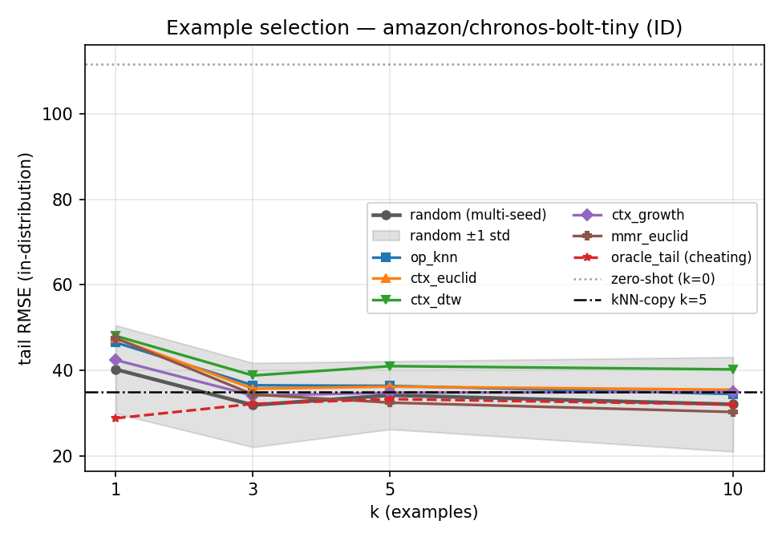

# Few-shot example selection — Phase 2 results

Protocol: fixed 245-trace pool, full-length example targets (t266), context 80, prediction 64, tail 80. Cells are `ID / OOD` tail RMSE; `random` is mean±std over 20 selection seeds, deterministic strategies are a single pass (seed 42). Most-similar example is placed LAST (adjacent to the query).

Model-free reference — kNN-copy k=5: **34.98 ID / 39.54 OOD**.

## NX-AI/TiRex

Zero-shot anchor (k=0): 78.92 ID / 62.49 OOD

| strategy | k=1 | k=3 | k=5 | k=10 |
|---|---|---|---|---|
| random | 44.84±7.75 / 40.68±3.46 | 37.83±8.89 / 38.07±3.69 | 35.95±6.94 / 36.05±2.24 | 38.97±7.31 / 37.07±3.75 |
| op_knn | 49.62 / 37.85 | 43.31 / 36.00 | 41.97 / 35.89 | 42.48 / 34.20 |
| ctx_euclid | 47.63 / 38.76 | 38.91 / 35.50 | 37.71 / 35.57 | 37.22 / 36.58 |
| ctx_dtw | 48.03 / 41.02 | 40.90 / 37.40 | 39.36 / 36.54 | 39.12 / 37.24 |
| ctx_growth | 48.51 / 40.11 | 39.86 / 34.99 | 37.83 / 34.19 | 38.45 / 34.71 |
| mmr_euclid | 47.63 / 38.76 | 43.99 / 37.89 | 40.90 / 37.10 | 41.06 / 38.58 |
| oracle_tail | 50.60 / 42.79 | 42.87 / 37.70 | 42.49 / 37.25 | 43.12 / 35.92 |

## amazon/chronos-2

Zero-shot anchor (k=0): 109.91 ID / 85.86 OOD

| strategy | k=1 | k=3 | k=5 | k=10 |
|---|---|---|---|---|
| random | 48.67±8.97 / 41.81±5.91 | 39.54±10.38 / 38.30±4.84 | 42.07±6.59 / 38.14±3.17 | 44.12±4.62 / 39.16±3.07 |
| op_knn | 47.72 / 42.45 | 43.93 / 38.67 | 44.53 / 29.41 | 43.60 / 36.56 |
| ctx_euclid | 54.47 / 44.24 | 40.75 / 35.39 | 41.27 / 39.16 | 41.53 / 37.35 |
| ctx_dtw | 57.66 / 42.89 | 48.28 / 34.36 | 42.66 / 37.39 | 41.70 / 39.87 |
| ctx_growth | 54.94 / 46.87 | 41.77 / 36.02 | 36.94 / 37.21 | 42.89 / 37.57 |
| mmr_euclid | 54.47 / 44.24 | 46.90 / 41.83 | 43.40 / 42.54 | 41.43 / 41.91 |
| oracle_tail | 55.61 / 51.36 | 45.28 / 44.15 | 41.91 / 42.37 | 42.26 / 37.66 |

## amazon/chronos-bolt-tiny

Zero-shot anchor (k=0): 111.65 ID / 90.69 OOD

| strategy | k=1 | k=3 | k=5 | k=10 |
|---|---|---|---|---|
| random | 40.20±10.31 / 44.26±10.36 | 31.85±9.85 / 38.00±4.59 | 34.15±7.97 / 36.28±2.70 | 32.02±11.06 / 37.70±4.02 |
| op_knn | 46.48 / 47.50 | 36.48 / 44.17 | 36.34 / 40.28 | 34.44 / 39.68 |
| ctx_euclid | 47.49 / 44.69 | 35.67 / 35.89 | 36.16 / 36.07 | 35.43 / 36.04 |
| ctx_dtw | 48.03 / 42.05 | 38.77 / 29.52 | 40.97 / 29.99 | 40.20 / 24.96 |
| ctx_growth | 42.39 / 36.03 | 34.07 / 45.53 | 34.74 / 38.08 | 34.92 / 35.38 |
| mmr_euclid | 47.49 / 44.69 | 34.34 / 36.91 | 32.42 / 37.19 | 30.23 / 35.72 |
| oracle_tail | 28.76 / 38.55 | 32.13 / 37.95 | 33.24 / 36.04 | 32.01 / 35.33 |

## google/timesfm-2.5-200m-pytorch

Zero-shot anchor (k=0): 97.54 ID / 87.70 OOD

| strategy | k=1 | k=3 | k=5 | k=10 |
|---|---|---|---|---|
| random | 53.08±10.93 / 47.44±10.14 | 39.63±10.67 / 37.87±4.79 | 41.41±8.26 / 38.02±4.18 | 40.82±9.12 / 38.10±4.87 |
| op_knn | 54.35 / 44.21 | 38.97 / 34.95 | 37.17 / 34.96 | 39.62 / 33.90 |
| ctx_euclid | 43.92 / 43.64 | 39.48 / 37.02 | 38.89 / 36.07 | 39.00 / 37.58 |
| ctx_dtw | 51.57 / 41.23 | 40.11 / 35.56 | 41.80 / 36.56 | 41.46 / 35.52 |
| ctx_growth | 55.40 / 60.11 | 41.18 / 38.52 | 42.08 / 34.72 | 37.51 / 35.29 |
| mmr_euclid | 43.92 / 43.64 | 44.50 / 42.17 | 42.32 / 39.59 | 39.03 / 37.99 |
| oracle_tail | 53.28 / 46.36 | 42.59 / 47.78 | 39.09 / 37.88 | 35.46 / 38.97 |

## Paired comparisons (pairing=trace, bootstrap CI primary)

Each strategy enters at its own best k (chosen by ID RMSE). Δ = RMSE(A) − RMSE(B); negative favours A. CI/p from a 10k paired bootstrap over traces; Wilcoxon shown for completeness (p floors 0.031 ID / 0.0625 OOD).

### NX-AI/TiRex
Best ks: random k=5, op_knn k=5, ctx_euclid k=10, ctx_dtw k=10, ctx_growth k=5, mmr_euclid k=5, oracle_tail k=5; best retrieval: **ctx_euclid**.

| A vs B | split | RMSE A | RMSE B | Δ(A−B) | 95% CI | p_boot | p_wilcoxon |
|---|---|---|---|---|---|---|---|
| random(k=5) vs op_knn(k=5) | ID | 36.58 | 41.97 | -5.39 | [-14.78, 2.28] | 0.226 | 0.219 |
| random(k=5) vs op_knn(k=5) | OOD | 36.12 | 35.89 | +0.23 | [-2.64, 8.97] | 0.792 | 0.625 |
| random(k=5) vs ctx_euclid(k=10) | ID | 36.58 | 37.22 | -0.65 | [-5.96, 5.70] | 0.800 | 1.000 |
| random(k=5) vs ctx_euclid(k=10) | OOD | 36.12 | 36.58 | -0.46 | [-2.76, 5.68] | 0.756 | 0.625 |
| random(k=5) vs ctx_dtw(k=10) | ID | 36.58 | 39.12 | -2.54 | [-11.26, 5.93] | 0.499 | 0.438 |
| random(k=5) vs ctx_dtw(k=10) | OOD | 36.12 | 37.24 | -1.12 | [-4.12, 5.47] | 0.652 | 0.625 |
| random(k=5) vs ctx_growth(k=5) | ID | 36.58 | 37.83 | -1.26 | [-5.04, 3.48] | 0.680 | 0.844 |
| random(k=5) vs ctx_growth(k=5) | OOD | 36.12 | 34.19 | +1.93 | [-0.01, 9.62] | 0.064 | 0.125 |
| random(k=5) vs mmr_euclid(k=5) | ID | 36.58 | 40.90 | -4.32 | [-9.54, 1.82] | 0.144 | 0.438 |
| random(k=5) vs mmr_euclid(k=5) | OOD | 36.12 | 37.10 | -0.98 | [-4.37, 12.73] | 0.730 | 0.812 |
| op_knn(k=5) vs ctx_euclid(k=10) | ID | 41.97 | 37.22 | +4.75 | [1.48, 10.16] | 0.000 | 0.031 |
| op_knn(k=5) vs ctx_euclid(k=10) | OOD | 35.89 | 36.58 | -0.69 | [-4.96, 0.39] | 0.178 | 0.312 |
| op_knn(k=5) vs ctx_dtw(k=10) | ID | 41.97 | 39.12 | +2.85 | [-1.04, 5.70] | 0.121 | 0.219 |
| op_knn(k=5) vs ctx_dtw(k=10) | OOD | 35.89 | 37.24 | -1.35 | [-3.67, -0.89] | 0.001 | 0.125 |
| op_knn(k=5) vs ctx_growth(k=5) | ID | 41.97 | 37.83 | +4.14 | [-2.71, 17.48] | 0.557 | 1.000 |
| op_knn(k=5) vs ctx_growth(k=5) | OOD | 35.89 | 34.19 | +1.70 | [-2.76, 4.56] | 0.254 | 0.438 |
| ctx_euclid(k=10) vs oracle_tail(k=5) | ID | 37.22 | 42.49 | -5.26 | [-14.83, 12.31] | 0.407 | 0.562 |
| ctx_euclid(k=10) vs oracle_tail(k=5) | OOD | 36.58 | 37.25 | -0.67 | [-6.53, 1.71] | 0.620 | 1.000 |
| ctx_euclid(k=10) vs kNN-copy(k=5) | ID | 37.22 | 34.98 | +2.24 | [-14.27, 18.74] | 0.782 | 0.438 |
| ctx_euclid(k=10) vs kNN-copy(k=5) | OOD | 36.58 | 39.54 | -2.96 | [-37.92, 25.44] | 0.782 | 0.625 |

### amazon/chronos-2
Best ks: random k=3, op_knn k=10, ctx_euclid k=3, ctx_dtw k=10, ctx_growth k=5, mmr_euclid k=10, oracle_tail k=5; best retrieval: **ctx_growth**.

| A vs B | split | RMSE A | RMSE B | Δ(A−B) | 95% CI | p_boot | p_wilcoxon |
|---|---|---|---|---|---|---|---|
| random(k=3) vs op_knn(k=10) | ID | 40.81 | 43.60 | -2.79 | [-8.86, 3.90] | 0.385 | 0.312 |
| random(k=3) vs op_knn(k=10) | OOD | 38.59 | 36.56 | +2.03 | [0.32, 10.20] | 0.011 | 0.125 |
| random(k=3) vs ctx_euclid(k=3) | ID | 40.81 | 40.75 | +0.06 | [-3.66, 5.23] | 0.992 | 0.844 |
| random(k=3) vs ctx_euclid(k=3) | OOD | 38.59 | 35.39 | +3.20 | [2.42, 7.09] | 0.000 | 0.062 |
| random(k=3) vs ctx_dtw(k=10) | ID | 40.81 | 41.70 | -0.89 | [-6.60, 5.46] | 0.738 | 0.562 |
| random(k=3) vs ctx_dtw(k=10) | OOD | 38.59 | 39.87 | -1.28 | [-4.68, 7.53] | 0.652 | 0.625 |
| random(k=3) vs ctx_growth(k=5) | ID | 40.81 | 36.94 | +3.87 | [-2.12, 12.02] | 0.493 | 0.688 |
| random(k=3) vs ctx_growth(k=5) | OOD | 38.59 | 37.21 | +1.37 | [-0.71, 7.99] | 0.417 | 0.812 |
| random(k=3) vs mmr_euclid(k=10) | ID | 40.81 | 41.43 | -0.62 | [-5.83, 6.47] | 0.912 | 1.000 |
| random(k=3) vs mmr_euclid(k=10) | OOD | 38.59 | 41.91 | -3.33 | [-6.39, 6.51] | 0.308 | 0.625 |
| op_knn(k=10) vs ctx_euclid(k=3) | ID | 43.60 | 40.75 | +2.85 | [-0.15, 7.67] | 0.065 | 0.156 |
| op_knn(k=10) vs ctx_euclid(k=3) | OOD | 36.56 | 35.39 | +1.17 | [-5.16, 2.71] | 0.440 | 0.625 |
| op_knn(k=10) vs ctx_dtw(k=10) | ID | 43.60 | 41.70 | +1.90 | [0.59, 2.98] | 0.007 | 0.094 |
| op_knn(k=10) vs ctx_dtw(k=10) | OOD | 36.56 | 39.87 | -3.31 | [-5.69, 1.05] | 0.073 | 0.312 |
| op_knn(k=10) vs ctx_growth(k=5) | ID | 43.60 | 36.94 | +6.66 | [-5.17, 17.28] | 0.295 | 0.312 |
| op_knn(k=10) vs ctx_growth(k=5) | OOD | 36.56 | 37.21 | -0.65 | [-10.42, 3.12] | 0.673 | 0.875 |
| ctx_growth(k=5) vs oracle_tail(k=5) | ID | 36.94 | 41.91 | -4.97 | [-13.70, 2.72] | 0.459 | 1.000 |
| ctx_growth(k=5) vs oracle_tail(k=5) | OOD | 37.21 | 42.37 | -5.16 | [-15.21, 5.95] | 0.177 | 0.312 |
| ctx_growth(k=5) vs kNN-copy(k=5) | ID | 36.94 | 34.98 | +1.95 | [-17.64, 29.71] | 0.820 | 0.562 |
| ctx_growth(k=5) vs kNN-copy(k=5) | OOD | 37.21 | 39.54 | -2.33 | [-38.63, 25.87] | 0.782 | 0.625 |

### amazon/chronos-bolt-tiny
Best ks: random k=3, op_knn k=10, ctx_euclid k=10, ctx_dtw k=3, ctx_growth k=3, mmr_euclid k=10, oracle_tail k=1; best retrieval: **mmr_euclid**.

| A vs B | split | RMSE A | RMSE B | Δ(A−B) | 95% CI | p_boot | p_wilcoxon |
|---|---|---|---|---|---|---|---|
| random(k=3) vs op_knn(k=10) | ID | 33.27 | 34.44 | -1.17 | [-12.57, 11.94] | 0.796 | 0.688 |
| random(k=3) vs op_knn(k=10) | OOD | 38.26 | 39.68 | -1.42 | [-6.32, 13.32] | 0.722 | 0.812 |
| random(k=3) vs ctx_euclid(k=10) | ID | 33.27 | 35.43 | -2.17 | [-5.93, 1.42] | 0.243 | 0.312 |
| random(k=3) vs ctx_euclid(k=10) | OOD | 38.26 | 36.04 | +2.23 | [-3.16, 14.68] | 0.468 | 0.625 |
| random(k=3) vs ctx_dtw(k=3) | ID | 33.27 | 38.77 | -5.50 | [-13.47, 3.68] | 0.213 | 0.312 |
| random(k=3) vs ctx_dtw(k=3) | OOD | 38.26 | 29.52 | +8.74 | [-4.53, 17.07] | 0.179 | 0.312 |
| random(k=3) vs ctx_growth(k=3) | ID | 33.27 | 34.07 | -0.80 | [-6.71, 6.37] | 0.858 | 1.000 |
| random(k=3) vs ctx_growth(k=3) | OOD | 38.26 | 45.53 | -7.27 | [-27.42, 5.49] | 0.458 | 0.812 |
| random(k=3) vs mmr_euclid(k=10) | ID | 33.27 | 30.23 | +3.04 | [-4.31, 8.68] | 0.420 | 0.438 |
| random(k=3) vs mmr_euclid(k=10) | OOD | 38.26 | 35.72 | +2.54 | [-3.82, 16.93] | 0.516 | 0.625 |
| op_knn(k=10) vs ctx_euclid(k=10) | ID | 34.44 | 35.43 | -1.00 | [-11.20, 7.17] | 0.866 | 0.844 |
| op_knn(k=10) vs ctx_euclid(k=10) | OOD | 39.68 | 36.04 | +3.65 | [-4.90, 17.16] | 0.349 | 0.812 |
| op_knn(k=10) vs ctx_dtw(k=3) | ID | 34.44 | 38.77 | -4.34 | [-10.35, 1.33] | 0.121 | 0.219 |
| op_knn(k=10) vs ctx_dtw(k=3) | OOD | 39.68 | 29.52 | +10.16 | [-13.45, 22.30] | 0.298 | 0.812 |
| op_knn(k=10) vs ctx_growth(k=3) | ID | 34.44 | 34.07 | +0.37 | [-18.86, 18.71] | 0.923 | 0.844 |
| op_knn(k=10) vs ctx_growth(k=3) | OOD | 39.68 | 45.53 | -5.85 | [-33.38, 9.43] | 0.625 | 1.000 |
| mmr_euclid(k=10) vs oracle_tail(k=1) | ID | 30.23 | 28.76 | +1.47 | [-17.56, 17.59] | 0.833 | 0.844 |
| mmr_euclid(k=10) vs oracle_tail(k=1) | OOD | 35.72 | 38.55 | -2.82 | [-5.84, 5.47] | 0.504 | 0.625 |
| mmr_euclid(k=10) vs kNN-copy(k=5) | ID | 30.23 | 34.98 | -4.75 | [-20.54, 18.10] | 0.694 | 1.000 |
| mmr_euclid(k=10) vs kNN-copy(k=5) | OOD | 35.72 | 39.54 | -3.82 | [-38.86, 24.10] | 0.782 | 0.625 |

### google/timesfm-2.5-200m-pytorch
Best ks: random k=3, op_knn k=5, ctx_euclid k=5, ctx_dtw k=3, ctx_growth k=10, mmr_euclid k=10, oracle_tail k=10; best retrieval: **op_knn**.

| A vs B | split | RMSE A | RMSE B | Δ(A−B) | 95% CI | p_boot | p_wilcoxon |
|---|---|---|---|---|---|---|---|
| random(k=3) vs op_knn(k=5) | ID | 40.97 | 37.17 | +3.80 | [-9.94, 14.97] | 0.575 | 0.844 |
| random(k=3) vs op_knn(k=5) | OOD | 38.16 | 34.96 | +3.20 | [0.95, 15.04] | 0.000 | 0.062 |
| random(k=3) vs ctx_euclid(k=5) | ID | 40.97 | 38.89 | +2.08 | [-0.51, 6.43] | 0.149 | 0.219 |
| random(k=3) vs ctx_euclid(k=5) | OOD | 38.16 | 36.07 | +2.09 | [0.81, 6.49] | 0.000 | 0.062 |
| random(k=3) vs ctx_dtw(k=3) | ID | 40.97 | 40.11 | +0.86 | [-8.95, 17.17] | 0.943 | 0.562 |
| random(k=3) vs ctx_dtw(k=3) | OOD | 38.16 | 35.56 | +2.60 | [2.08, 7.04] | 0.000 | 0.062 |
| random(k=3) vs ctx_growth(k=10) | ID | 40.97 | 37.51 | +3.46 | [-0.86, 12.28] | 0.222 | 0.219 |
| random(k=3) vs ctx_growth(k=10) | OOD | 38.16 | 35.29 | +2.87 | [0.63, 14.38] | 0.010 | 0.125 |
| random(k=3) vs mmr_euclid(k=10) | ID | 40.97 | 39.03 | +1.94 | [-0.58, 5.18] | 0.181 | 0.312 |
| random(k=3) vs mmr_euclid(k=10) | OOD | 38.16 | 37.99 | +0.17 | [-1.57, 8.12] | 0.865 | 1.000 |
| op_knn(k=5) vs ctx_euclid(k=5) | ID | 37.17 | 38.89 | -1.72 | [-13.32, 13.82] | 0.802 | 0.844 |
| op_knn(k=5) vs ctx_euclid(k=5) | OOD | 34.96 | 36.07 | -1.11 | [-9.18, 0.50] | 0.251 | 0.312 |
| op_knn(k=5) vs ctx_dtw(k=3) | ID | 37.17 | 40.11 | -2.94 | [-12.41, 7.33] | 0.666 | 0.844 |
| op_knn(k=5) vs ctx_dtw(k=3) | OOD | 34.96 | 35.56 | -0.60 | [-11.01, 1.53] | 0.752 | 0.812 |
| op_knn(k=5) vs ctx_growth(k=10) | ID | 37.17 | 37.51 | -0.35 | [-14.04, 21.16] | 0.918 | 1.000 |
| op_knn(k=5) vs ctx_growth(k=10) | OOD | 34.96 | 35.29 | -0.34 | [-6.09, 2.28] | 0.732 | 1.000 |
| op_knn(k=5) vs oracle_tail(k=10) | ID | 37.17 | 35.46 | +1.70 | [-12.35, 25.77] | 0.902 | 0.844 |
| op_knn(k=5) vs oracle_tail(k=10) | OOD | 34.96 | 38.97 | -4.01 | [-24.10, 1.86] | 0.320 | 0.625 |
| op_knn(k=5) vs kNN-copy(k=5) | ID | 37.17 | 34.98 | +2.18 | [-4.25, 17.39] | 0.522 | 0.438 |
| op_knn(k=5) vs kNN-copy(k=5) | OOD | 34.96 | 39.54 | -4.58 | [-43.41, 24.39] | 0.782 | 0.625 |

## Interpretation notes

- **oracle_tail is a cheating diagnostic**, not a method: it selects pool
  examples by the query's ground-truth tail mean. It is nearest-LABEL
  selection, not a model-in-the-loop upper bound — it shows how much signal
  perfectly level-matched examples carry under the current presentation
  format, not the best any selector could do.
- **Per-example z-scoring caveat**: the ICL pipeline z-scores every example
  independently, which erases absolute level — the very signal retrieval is
  supposed to inject (the metric is tail-LEVEL RMSE). If oracle_tail lands
  near random, the conclusion is "the presentation format hides level
  information", which hands off to Phase 3's shared-scaling ablation rather
  than condemning retrieval per se.
- TimesFM k=10 full-length example contexts exceed its max_context=2048 and
  are left-truncated — identical to the Phase-1 protocol, kept for
  comparability.
- MPS is not bit-deterministic: deterministic selection does not imply
  bit-identical RMSE across re-runs. All comparisons here live within one
  grid run.
- Wilcoxon p floors at 0.031 (n=6 ID) / 0.0625 (n=5 OOD) under
  pairing="trace"; the bootstrap CI is the primary evidence.
